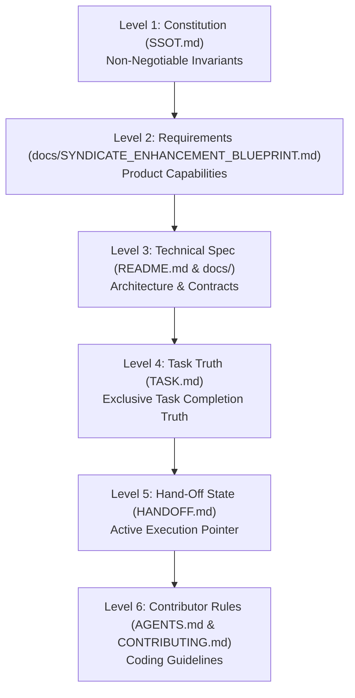

# Contributing to Syndicate Protocol

Welcome! We are thrilled that you want to contribute to **The Syndicate Protocol** — the portable Single Source of Truth (SSOT) methodology and zero-drift governance operating system for multi-agent and multi-contributor software engineering.

Whether you are a human software engineer or an autonomous AI coding agent, this guide outlines our code standards, architectural invariants, contribution workflows, and licensing terms.

---

## 📑 Table of Contents

1. [Our Core Ethos & Licensing Invariants](#1-our-core-ethos--licensing-invariants)
2. [Developer Certificate of Origin (DCO)](#2-developer-certificate-of-origin-dco)
3. [The 6-Level Authority Hierarchy & Invariants](#3-the-6-level-authority-hierarchy--invariants)
4. [Prerequisites & Development Setup](#4-prerequisites--development-setup)
5. [The Standard Contributor Workflow](#5-the-standard-contributor-workflow)
6. [Polyglot Coding Standards](#6-polyglot-coding-standards)
7. [Automated Verification & Quality Gates](#7-automated-verification--quality-gates)
8. [Submitting Pull Requests & PR Checklist](#8-submitting-pull-requests--pr-checklist)
9. [Code of Conduct & Community Standards](#9-code-of-conduct--community-standards)

---

## 1. Our Core Ethos & Licensing Invariants

Syndicate Protocol is released under the **Syndicate Community Source License (Anti-SaaS & Anti-Commercialization)** (see [`LICENSE`](./LICENSE)).

We believe in keeping the protocol open, free, and accessible for everyone, while strictly prohibiting corporate exploitation:

- ✅ **Free for All Developers & Teams**: You may freely study, inspect, fork, modify, and run Syndicate Protocol locally on your workstations and private self-hosted CI pipelines for your own internal engineering.
- 🚫 **Strict Anti-SaaS Prohibition**: You may NOT operate, host, or offer Syndicate Protocol (or its CLI/dashboard/engine) as a commercial SaaS, cloud API, or managed service.
- 🚫 **Zero Direct or Indirect Charges**: No party may charge fees for access to or use of this software.
- 🚫 **Anti-Bundling Restriction**: The software may NOT be offered "free" within a paid product, commercial suite, or subscription service.
- 🚫 **Anti-White-Labeling**: Attribution notices, copyright headers, ASCII banners, and logos must remain intact.

---

## 2. Developer Certificate of Origin (DCO)

To ensure that all contributions remain free from proprietary encumbrances and comply with our Anti-SaaS license, Syndicate Protocol adopts the standard **Developer Certificate of Origin (DCO)**.

By contributing to this project, you certify that:

```text
Developer's Certificate of Origin 1.1

By making a contribution to this project, I certify that:

(a) The contribution was created in whole or in part by me and I
    have the right to submit it under the Syndicate Community Source License; or

(b) The contribution is based upon previous work that, to the best
    of my knowledge, is covered under an appropriate open source license
    and I have the right under that license to submit that work with
    modifications, whether created in whole or in part by me, under the same
    Syndicate Community Source License; or

(c) The contribution was provided directly to me by some other
    person who certified (a), (b) or (c) and I have not modified it.

(d) I understand and agree that this project and the contribution
    are public and that a record of the contribution (including all
    personal information I submit with it, including my sign-off) is
    maintained indefinitely and may be redistributed consistent with
    this project or the open source license(s) involved.
```

### How to Sign Off Your Commits
Please sign off on all commits using the `-s` flag:
```bash
git commit -s -m "feat(cli): add telemetry ring buffer exporter"
```
This appends a `Signed-off-by: Your Name <your.email@example.com>` line to your commit message.

---

## 3. The 6-Level Authority Hierarchy & Invariants

All contributors must respect the authority hierarchy established in [`SSOT.md`](./SSOT.md):



### Critical Invariants to Remember:
1. **Rule 6 (No Fake Complete Status)**: A task in [`TASK.md`](./TASK.md) may **only** be marked `[x]` if it is backed by real, working, verified code. Never check off stubs, placeholders, or mocked fallbacks.
2. **Zero Shadow Trackers**: Never create parallel task trackers (`TODO.md`, `NOTES.md`, `SCRATCH.md`). `TASK.md` is the **exclusive** task authority.
3. **Atomic Living Documentation**: Every code modification must update `TASK.md` and `HANDOFF.md` in the **same commit**.
4. **Decoupled Innovation Architecture (Rule 7)**: Future suggestions and architectural ideas belong in [`docs/INNOVATION.md`](./docs/INNOVATION.md) (via `syn discover`), decoupled from immediate fixes.

---

## 4. Prerequisites & Development Setup

Ensure you have the following toolchains installed:

| Tool | Required Version | Purpose |
| :--- | :--- | :--- |
| **Go** | `>= 1.22` (1.27 recommended) | Native CLI engine (`cmd/syn`, `internal/`) |
| **Node.js** | `>= 20.0.0` (LTS) | ESM governance validators & scripts |
| **pnpm** | `>= 9.0.0` | Package manager for root and `web/` |
| **Git** | `>= 2.40` | Source control & worktree isolation |

### Clone & Bootstrap
```bash
# 1. Clone the repository
git clone https://github.com/Syndicate-Protocol/syndicate-protocol.git
cd syndicate-protocol

# 2. Install Node dependencies
pnpm install
pnpm --dir web install

# 3. Build the native Go CLI
pnpm run build:cli

# 4. Install the pre-commit anti-drift gate
./bin/syn hook install
```

---

## 5. The Standard Contributor Workflow

We follow a disciplined, continuous session lifecycle supported by `syn`:

```text
      ┌───────────────┐
      │   syn start   │  ◄── 1. Onboard & inspect baseline
      └───────┬───────┘
              ▼
   ┌─────────────────────┐
   │ syn worktree create │  ◄── 2. Isolate swarm workspace (.worktrees/)
   └──────────┬──────────┘
              ▼
     ┌─────────────────┐
     │ Implement & Test│  ◄── 3. Real code only (Rule 6 compliant)
     └────────┬────────┘
              ▼
     ┌─────────────────┐
     │   syn verify    │  ◄── 4. Verify AST & SSOT integrity
     │   syn harden    │  ◄── 5. Adversarial audit for mocks/stubs
     └────────┬────────┘
              ▼
     ┌─────────────────┐
     │   syn handoff   │  ◄── 6. Update HANDOFF.md & stage commit
     └─────────────────┘
```

### Step 1: Session Start
Run `syn start` to verify the repository baseline, check for expired swarm leases, and prompt for your active task:
```bash
syn start
```

### Step 2: Worktree Workspace Isolation
For multi-agent concurrency or isolated feature development, use git worktrees under `.worktrees/`:
```bash
syn worktree create feature/my-enhancement
cd .worktrees/feature-my-enhancement
```

### Step 3: Implement with SSOT Discipline
- Work in small, focused chunks.
- As you complete features, update the corresponding checkboxes in [`TASK.md`](./TASK.md).
- Preserve existing docstrings and code integrity.

### Step 4: Verify Locally Before Committing
Run the full verification suite:
```bash
# 1. SSOT Document and file reference integrity
pnpm run verify:ssot

# 2. Deep AST signature indexing & git recency staleness
syn verify --deep

# 3. Adversarial Rule 6 audit
syn harden --strict

# 4. Run Go unit tests
go test ./...

# 5. Build and typecheck web dashboard
pnpm --dir web build
```

### Step 5: Continuous Codebase Review & Task/Milestone Completion Presentation
At the completion of every task and/or milestone, contributors must audit the codebase:
- **Security Audit & Immediate Fixes**: Any identified security vulnerability, leak risk, edge-case bug, or technical debt MUST be documented within the in-depth `walkthrough.md` artifact for developer immediate review, and prioritized for immediate remediation to preserve Rule 6 zero-debt compliance.
- **Innovation Registry Cataloging**: All other ideas (architectural enhancements, ergonomics suggestions, performance optimizations, and new features) MUST be cataloged in [`docs/INNOVATION.md`](./docs/INNOVATION.md) for on-demand review (`syn discover list`).
- **Walkthrough Artifact Link**: The final review presented to the developer MUST provide a direct clickable link to the generated `walkthrough.md`.

When wrapping up a task or handing off to another agent/contributor:
```bash
syn handoff
```
Commit using Conventional Commits with DCO sign-off:
```bash
git commit -s -m "feat(engine): implement lease heartbeat reaper"
```

---

## 6. Polyglot Coding Standards

### Go CLI Engine (`cmd/syn/`, `internal/`)
- **Structure**: Commands use [Cobra](https://github.com/spf13/cobra). Terminal UI and styling use [Charm](https://charm.sh) libraries ([Lip Gloss](https://github.com/charmbracelet/lipgloss), [Bubble Tea](https://github.com/charmbracelet/bubbletea), [Huh](https://github.com/charmbracelet/huh), [Glamour](https://github.com/charmbracelet/glamour)).
- **Theming**: Never hardcode ANSI escape codes. Always use Lip Gloss tokens defined in [`internal/theme/styles.go`](./internal/theme/styles.go).
- **Zero Stubs**: Every function must implement real logic. Do not catch errors and substitute hardcoded mock data.
- **Platform Independence**: Ensure all file paths use `filepath.Join` and work seamlessly on both Windows and POSIX systems.

### Web Dashboard (`web/`)
- **Framework**: React 19 + TypeScript + Vite + Tailwind CSS v4.
- **Type Safety**: No `any` types. Ensure `tsc -b` passes with zero errors.
- **Icons**: Use [Lucide React](https://lucide.dev) icons.
- **Zero Dependency Server**: The web frontend compiles to static assets served by Go's `embed.FS` in [`internal/web/server.go`](./internal/web/server.go). Always run `pnpm --dir web build` after frontend edits.

### Documentation & Markdown (`docs/`, `*.md`)
- **GFM Compliant**: Standard GitHub Flavored Markdown.
- **Mermaid Diagrams**: Only supported diagram types (`flowchart`, `sequenceDiagram`, `stateDiagram-v2`).
- **File Links**: Use relative markdown links with correct capitalization.

---

## 7. Automated Verification & Quality Gates

Every Pull Request must pass all automated verification gates:

1. **SSOT Validator (`pnpm run verify:ssot`)**:
   - Confirms all 5 living root files exist.
   - Confirms every file reference declared in completed `[x]` tasks exists on disk.
   - Detects and rejects any disallowed shadow task trackers (`TODO.md`, `NOTES.md`).
2. **Deep AST Signatures (`syn verify --deep`)**:
   - Parses fenced code blocks in documentation and verifies declared functions, structs, and methods against source code exports in Go, TS, Python, Rust, and C#.
   - Audits git commit timestamps to prevent documentation staleness drift.
3. **Adversarial Hardening Gate (`syn harden --strict`)**:
   - Scans code for suspicious mock markers, hardcoded dummy returns, and simulated success paths. Must achieve an integrity score of **100.0%**.

---

## 8. Submitting Pull Requests & PR Checklist

Before submitting your Pull Request, complete this checklist:

- [ ] All commits are signed off with DCO (`git commit -s`).
- [ ] Code strictly complies with the **Syndicate Community Source License (Anti-SaaS)**.
- [ ] You have reviewed and agreed to uphold the [**Code of Conduct**](./CODE_OF_CONDUCT.md).
- [ ] No API keys, credentials, or `.reference__items/` artifacts are committed.
- [ ] `pnpm run verify:ssot` passes with zero errors.
- [ ] `syn verify --deep` passes with zero drift.
- [ ] `syn harden --strict` passes with 100.0% integrity score.
- [ ] `go test ./...` passes all unit tests.
- [ ] `TASK.md` reflects true completion status (no unchecked stubs).
- [ ] `HANDOFF.md` is updated with your latest work and clear next steps.

---

## 9. Code of Conduct & Community Standards

We are committed to providing a welcoming, inclusive, and harassment-free environment for all human contributors, maintainers, and operators of autonomous AI software engineering agents.

Please read our full [**Contributor Covenant Code of Conduct (`CODE_OF_CONDUCT.md`)**](./CODE_OF_CONDUCT.md). Instances of abusive or unacceptable behavior can be reported to **`conduct@syntaxsyndicate.com`**.

Thank you for helping keep the **Syndicate Protocol** authoritative, robust, and zero-drift!

