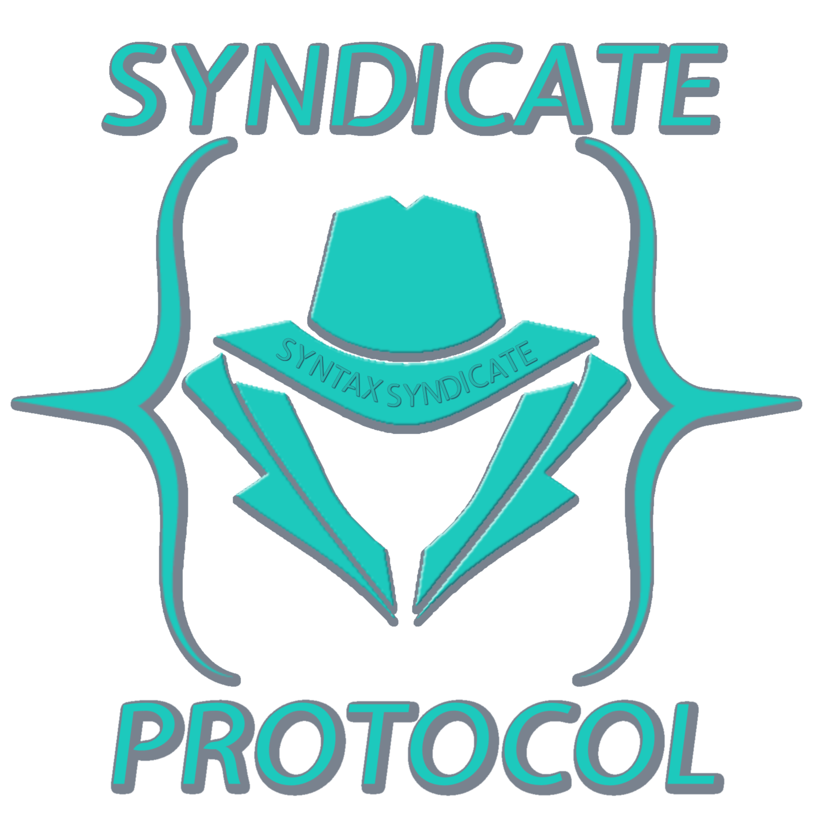
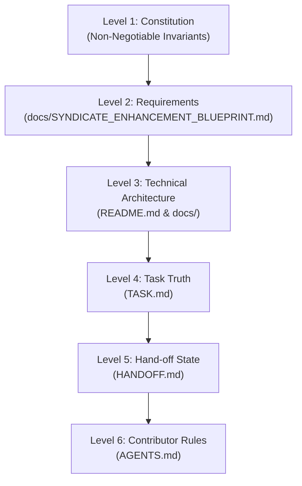

<p align="center">
  
</p>

# The Syndicate Protocol

[-blueviolet.svg)](LICENSE)
[](https://github.com/Syndicate-Protocol/syndicate-protocol)
[](./README.md)
[](https://github.com/Syndicate-Protocol/syndicate-protocol)

> **A portable Single Source of Truth (SSOT) methodology and governance operating system for multi-agent, multi-contributor software engineering.**

---

## What is Syndicate Protocol?

The **Syndicate Protocol** is a lightweight, file-based governance operating system designed to prevent a codebase's *documented* state and its *actual* reality from drifting apart — across any number of contributors (human or AI) and across asynchronous sessions.

- **What it is**: A disciplined set of operational conventions, an authoritative 6-level document hierarchy, and an automated verification toolchain (`syn` CLI) ensuring that code, documentation, and task truth remain synchronized in every commit.
- **What it is not**: Heavyweight project management software, a proprietary SaaS platform, or a replacement for team issue trackers. It runs locally with zero external runtime or vendor lock-in.
- **Origin**: This methodology was originally developed and battle-tested as the internal development process for SyndicateDB, and generalized here for universal reuse under the name **Syndicate Protocol** — a "syndicate" being an alliance of autonomous parties (human engineers and AI coding agents) operating under shared, non-negotiable rules.

---

## The Problems This Solves

Any codebase touched by more than one contributor over multiple sessions — especially where AI coding agents participate alongside or instead of humans — suffers from predictable failure modes:

1. **Status Drift**: A feature gets marked "done" and the claim outlives the reality. Code gets refactored, an API signature changes, or an edge case breaks — yet nothing updates the doc that claimed it was finished.
2. **Context Loss**: Every new session (a fresh AI agent conversation, a returning developer, or a teammate picking up a branch) must re-derive "what is actually true right now" from scratch, guessing from half-stale comments and chat logs.
3. **Parallel Truth**: Without a single authoritative place for tasks, contributors invent shadow trackers — a `TODO.md` in a subdirectory, a Notion board, or uncommitted conversational memory — and they silently diverge.
4. **Fake "Complete" Status (The Most Expensive Failure Mode)**: Under context window limits or time pressure, stubs, mock fallbacks, or placeholder UIs get checked off because the code compiles and passes minimal assertions. This hidden technical debt remains invisible until other subsystems depend on the real implementation.

The Syndicate Protocol makes these failure modes structurally impossible by enforcing an unambiguous authority hierarchy, strict anti-drift rules, and automated verification gates.

---

## The 6-Level Authority Hierarchy

Every architectural claim, requirement, task status, and operational rule lives at exactly one level. When two documents or instructions conflict, **the higher level always wins, and the lower one is considered drifting and must be remediated**:



| Level | Document | Authority & Scope | Update Cadence |
| :--- | :--- | :--- | :--- |
| **1. Constitution** | [`SSOT.md`](./SSOT.md) | Absolute non-negotiables: Zero vendor lock-in, zero telemetry without opt-in, strict Rule 6 (no fake completions), and atomic living documentation. | Rarely — fundamental project covenants. |
| **2. Requirements** | [`docs/SYNDICATE_ENHANCEMENT_BLUEPRINT.md`](./docs/SYNDICATE_ENHANCEMENT_BLUEPRINT.md) | *What* the system delivers — functional specifications, scope boundaries, and capability pillars. | Occasionally — as product roadmap evolves. |
| **3. Technical Spec** | [`README.md`](./README.md) & [`docs/`](./docs/) | *How* the system is built — subsystem contracts, interfaces, and architecture diagrams. | When architecture changes. |
| **4. Task Truth** | [`TASK.md`](./TASK.md) | The **exclusive** authorized record of what is pending `[ ]`, in progress `[/]`, or completed `[x]`. | Continuously, in real time. |
| **5. Hand-off State** | [`HANDOFF.md`](./HANDOFF.md) | The live operational pointer: active milestone, latest commit hash, immediate next action, and session review. | At the conclusion of every session. |
| **6. Contributor Rules** | [`AGENTS.md`](./AGENTS.md) | Rules of engagement: coding standards, commit discipline, directory layout, and multi-agent protocols. | Rarely. |

---

## The Five Living Root Documents

The repository enforces a strict separation between **living root documents** (files at the repository root that are read and updated constantly) and **reference documentation** (deep dives, specs, and blueprints organized in `docs/`):

| File | Role | Core Invariant |
| :--- | :--- | :--- |
| **[`SSOT.md`](./SSOT.md)** | Single Source of Truth authority document and conflict resolution protocols. | Read first in every session. The map of authority. |
| **[`README.md`](./README.md)** | Public-facing orientation, founding specification, and quickstart. | Front door of the project. Never leak live task trackers here. |
| **[`TASK.md`](./TASK.md)** | Exclusive living task progress tracker. | If it's not checked off here, it's not done — regardless of code state. |
| **[`HANDOFF.md`](./HANDOFF.md)** | Live session hand-off pointer and operational state. | Update and stage before concluding any session. |
| **[`AGENTS.md`](./AGENTS.md)** | Contributor and AI coding agent operational guidelines and standards. | Governs *how* work gets done, never *what* is done. |

> [!IMPORTANT]
> **Strict File-System Ownership**: Only these five living documents belong at the repository root. All reference documents, research notes, and architectural specifications belong in the centralized [`docs/`](./docs/) hub.

---

## The Seven Anti-Drift Rules

All human contributors and AI agents must strictly adhere to the seven operational anti-drift rules:

1. **No Parallel or Shadow Trackers**: Never create `TODO.md`, `NOTES.md`, `TASKS_NEW.md`, or track progress in chat memory. All tasks live exclusively in [`TASK.md`](./TASK.md); all hand-off notes live in [`HANDOFF.md`](./HANDOFF.md).
2. **Atomic Living Documentation Updates**: Whenever code is added or modified, documentation status updates must land in the **same commit** — never deferred to a later session.
3. **Strict File-System Ownership**: Reference documentation belongs in `docs/`. Exactly the five living root files exist at the repository root.
4. **Mandatory Automated Verification Gate**: No task may be concluded or handed off without running and passing `syn verify --deep` and `syn harden`.
5. **Disciplined Conventional Commits**: Commit at the completion of every logical unit of work using Conventional Commits (`feat:`, `fix:`, `docs:`, `refactor:`, `test:`). Never leave uncommitted or unstaged changes before handing off.
6. **No Fake "Complete" Status (Strict Zero-Mock Policy)**: A task may only be marked `[x]` in `TASK.md` if backed by real, verified, working code. Stubs, mock fallbacks substituting synthetic data on failure, or placeholder UIs pretending to work are strictly forbidden from being marked complete.
7. **The Mandatory SEFN Task Review Standard (Decoupled Innovation Architecture)**: When presenting task reviews and walkthroughs, raw suggestions and enhancements are NOT displayed inline, preventing developer confusion and recursive execution loops. Instead, reviews structuredly detail:
   - **Innovations Cataloged (`docs/INNOVATION.md`)**: Count of suggestions pooled into the living registry for on-demand inspection via `syn discover list` or the web dashboard.
   - **Fixes**: Identified bugs, rough edges, warnings, or debt remediated immediately at review to preserve Rule 6 zero-debt compliance.
   - **Next-Steps**: The immediate, ordered actionable tasks on the active roadmap.

---

## Verification Gates & The Hardening Pattern

### Automated Static Verification Gate

The protocol is backed by automated tooling rather than mere good intentions. The verification engine (`syn verify` or `scripts/verify-ssot.mjs`) automatically audits:

- Presence and health of all 5 living root documents and the `docs/` hub.
- Verifies that every file path referenced in a completed (`[x]`) task in `TASK.md` actually exists on disk.
- Extracts AST signatures across Go, TypeScript, JavaScript, Python, Rust, and C# to ensure documented signatures match actual code exports.
- Detects and flags unauthorized shadow trackers (`TODO.md`, `NOTES.md`).

### The Adversarial Hardening Gate Pattern

To guarantee compliance with Rule 6, the protocol establishes **Hardening Gates** (`syn harden`):

- Clean-context adversarial audit scanning recent `[x]` tasks for stubs, unimplemented errors, or mock variables (`TODO`, `FIXME`, `unimplemented`, `placeholder`, `dummyData`).
- Generates an adversarial `HARDENING_REPORT.md` and halts pipeline execution if fake completions are detected.

---

## Daily Contributor & Agent Lifecycle

Every session — whether performed by a human engineer or an autonomous AI coding agent — follows a standardized lifecycle:

```bash
# 1. Onboard / Resume: Verify baseline, inspect active milestone & next task
syn start

# 2. Work in small, tested, atomic increments...

# 3. Verify SSOT integrity & audit Rule 6 compliance
syn verify --deep
syn harden

# 4. Wrap up session: Enforce clean environment gates, update HANDOFF.md, and stage changes
syn handoff
```

- **`syn start`**: Canonical receiving command. Inspects active milestones, detects next pending task, and interactively prompts the developer whether to **Begin Next Task** (marking it `[/]` in `TASK.md` and staging it) or **Review Documented Innovations** (with instant promotion capability).
- **`syn handoff`**: Canonical wrap-up command. Cleans expired swarm worktree leases, verifies zero shadow trackers, validates SSOT and Rule 6 compliance, updates `HANDOFF.md`, and stages all files with `git add -A`.

---

## ⚡ Global Installation (`syn` CLI)

Install the standalone native Go `syn` CLI globally on any operating system with a single command:

### Windows (PowerShell)

```powershell
irm https://raw.githubusercontent.com/Syndicate-Protocol/syndicate-protocol/main/scripts/install.ps1 | iex
```

### macOS & Linux (Bash)

```bash
curl -fsSL https://raw.githubusercontent.com/Syndicate-Protocol/syndicate-protocol/main/scripts/install.sh | bash
```

### CLI Quickstart

```bash
# Run comprehensive repository diagnostics
syn doctor

# Launch the embedded React 19 cybernetic dashboard with terminal & live telemetry
syn web --open

# Update the global binary to the latest workspace build
syn update
```

---

## Adopting in Your Own Project

You can adopt the Syndicate Protocol in any codebase in under 60 seconds:

1. **Automated Adoption (CLI)**:

   ```bash
   # Initialize in an existing repository
   syn adopt
   ```

2. **Template Kit (Manual)**:
   - Browse [`syndicate-protocol-kit/`](./syndicate-protocol-kit/) for ready-to-use template files with `[PLACEHOLDER]` markers.
   - Follow the instructions in [`syndicate-protocol-kit/README.md`](./syndicate-protocol-kit/README.md).

---

## When This Is (and Isn't) Worth It

- **A Perfect Fit For**:
  - Codebases where multiple contributors (human developers or AI agents across separate sessions) collaborate.
  - Projects where fake completion, drift, and undocumented breaking changes are expensive to detect late.
  - Teams seeking consistent, disciplined git history and high-context multi-agent handoffs.
- **Overkill For**:
  - Single-session throwaway prototypes or weekend scripts.
  - Simple projects where the entire mental model fits in a single developer's head and requires no asynchronous continuity.

---

## Repository Quick Map

```text
├── SSOT.md                          # Constitutional authority hierarchy & invariants
├── README.md                        # Founding specification, overview & quickstart (you are here)
├── TASK.md                          # Authoritative live task & milestone tracker
├── HANDOFF.md                       # Active operational state pointer between sessions
├── AGENTS.md                        # Contributor & agent operating standards & guidelines
├── ssot.config.json                 # SSOT validator configuration
├── cmd/syn/                         # High-speed native Go CLI entrypoint
├── internal/                        # CLI engines (validator, auditor, lease, innovation, web)
├── web/                             # React 19 cybernetic embedded web dashboard
├── scripts/
│   ├── verify-ssot.mjs              # Anti-drift integrity check script
│   ├── install.ps1                  # Windows global installer
│   └── install.sh                   # macOS & Linux global installer
├── syndicate-protocol-kit/          # Ready-to-copy adoption kit for other projects
│   ├── README.md
│   └── *.template.md
└── docs/
    ├── README.md                    # Central documentation index
    ├── COMMANDS.md                  # Complete CLI command & testing manual
    ├── INNOVATION.md                # Decoupled living innovation registry
    └── SYNDICATE_ENHANCEMENT_BLUEPRINT.md # Master architectural roadmap
```

---

## 🤝 Contributing

We welcome contributions from human software engineers and autonomous AI coding agents alike! To preserve architectural integrity and legal compliance:

- Review the [**Contributor Guide & Standards (`CONTRIBUTING.md`)**](./CONTRIBUTING.md).
- Follow the Level 6 Rules of Engagement in [`AGENTS.md`](./AGENTS.md).
- Every contribution is subject to the Developer Certificate of Origin (DCO) and the Anti-SaaS license terms.

---

## ⚖️ License, Ethical Non-Commercial Covenant & Zero-Fee Guarantee

Syndicate Protocol is governed by the **Syndicate Community Source License (Anti-SaaS & Anti-Commercialization)**. See [`LICENSE`](./LICENSE) for full legal text.

- **100% Free & Open Access**: You are free to inspect, run, modify, fork, and use the software for personal, academic, and internal software engineering workflows.
- **Strict Anti-SaaS Prohibition**: You may not host, operate, or provide Syndicate Protocol as a cloud service, managed SaaS, or paid platform API.
- **Zero Direct or Indirect Fees**: You may not charge any party for the use of this software.
- **Anti-Bundling Restriction**: The software may not be bundled, embedded, or offered "for free" within any commercial, paid, or subscription-based product or service.
- **Attribution Preservation**: Official ASCII banners, logos, and copyright notices cannot be stripped or white-labeled.

### 🛑 Consumer Protection: Never a Fee, Charge, or Subscription

There will **NEVER** be a fee, charge, paid tier, or subscription associated with Syndicate Protocol — directly or indirectly. The software and methodology are perpetually free.

> [!CAUTION]
> **Have you been charged for Syndicate Protocol?**
> If any company, vendor, or third party has charged you money for Syndicate Protocol, sold you access, or bundled it into a paid subscription or service, you have been subjected to an unauthorized violation of the Syndicate Community Source License.
>
> 1. **Request an immediate refund**: Demand a full refund from the unauthorized seller.
> 2. **Report the violation**: Please report the incident directly to our team:
>    - **Email**: `splv@syntaxsyndicate.com`
>    - **Subject**: `Syndicate Protocol License Violation`
>    *(Please include transaction receipts, vendor names, or URLs. An online reporting form will also be available on our website).*

