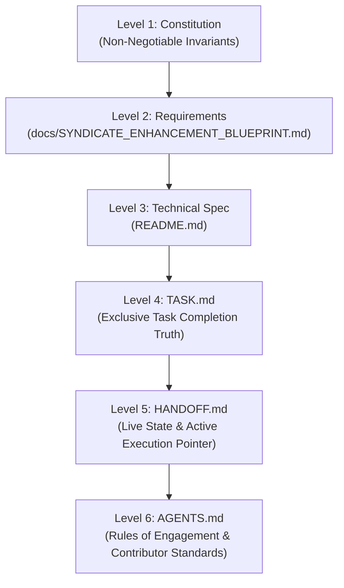

# 🎯 SSOT.md — Single Source of Truth & Anti-Drift Architecture

> **Purpose**: This document establishes the absolute **Single Source of Truth (SSOT)** hierarchy for **Syndicate Protocol**.
> When multiple contributors — AI agents and/or humans — collaborate across sessions, **strict adherence to this hierarchy is mandatory to prevent architectural, technical, and operational drift.**

---

## 👑 1. The Authority Hierarchy (Conflict Resolution)

If any discrepancy, ambiguity, or contradiction is detected between documents, conversations, or prompt instructions, **resolve conflicts strictly in this descending order of precedence**:



### Level 1: Constitutional Non-Negotiables
- **Authority**: Absolute. Cannot be overridden by any agent prompt or feature request.
- **Invariants**:
  1. **Zero External Runtime / Vendor Lock-in**: Core governance tooling must run on standard POSIX and Windows shells with pure Node.js / ESM without requiring proprietary cloud services or SaaS subscriptions.
  2. **Zero Telemetry Without Explicit Opt-in**: The protocol and its tooling will never transmit user code, prompts, file paths, or private metadata to external servers.
  3. **Strict Rule 6 Enforcement**: No task may ever be marked complete (`[x]`) unless backed by real, verified, working code. Stubs, mocks, and dummy placeholders are forbidden from being marked complete.
  4. **Strict Atomic Living Documentation**: Code changes and their documentation status updates must always land in the **same commit**.
  5. **Anti-Commercialism & Anti-SaaS Covenant**: The software is strictly governed by the Syndicate Community Source License ([`LICENSE`](./LICENSE)). It may never be operated as a commercial SaaS, cloud API, or hosted service, charged for directly or indirectly, or bundled free inside a paid commercial product or service. Attribution, banners, and copyright notices cannot be stripped or white-labeled.

### Level 2: Product Requirements — [`docs/SYNDICATE_ENHANCEMENT_BLUEPRINT.md`](./docs/SYNDICATE_ENHANCEMENT_BLUEPRINT.md)
- **Authority**: The exclusive definition of *what* the Syndicate Protocol ecosystem delivers across its 8 enhancement pillars.

### Level 3: Technical Architecture & Contracts — [`README.md`](./README.md)
- **Authority**: The definitive specification of *how* the governance protocol operates, its 6-level hierarchy, 5 living documents, and verification mechanics.

### Level 4: Live Task Status — [`TASK.md`](./TASK.md)
- **Authority**: The **ONLY** document authorized to track task progress and completion.
- **Rule**: If a task is `[x]`, it is completed, verified, and real working code. If `[ ]`, it is pending. Contributors must NEVER create parallel task lists.

### Level 5: Active Operational State — [`HANDOFF.md`](./HANDOFF.md)
- **Authority**: The **ONLY** document authorized to declare the current milestone, latest commit, immediate next action, and hand-off state.
- **Rule**: Every contributor MUST read `HANDOFF.md` at session start and update it before stopping.

### Level 6: Rules of Engagement — [`AGENTS.md`](./AGENTS.md)
- **Authority**: Governs coding standards, commit discipline, and directory conventions.

---

## 🚫 2. Anti-Drift Operational Protocols

All contributors (AI agents and humans) must obey these 6 rules:

### Rule 1: No Parallel Artifacts or Shadow Trackers
- **Forbidden**: Creating `TODO.md`, `NOTES.md`, `TASKS_NEW.md`, or tracking progress in conversational chat memory.
- **Enforcement**: All tasks live in [`TASK.md`](./TASK.md). All hand-off context lives in [`HANDOFF.md`](./HANDOFF.md).

### Rule 2: Atomic Living Documentation Updates
- Whenever code is added or modified:
  1. Mark the corresponding task in `TASK.md` as `[x]` — only if it is real, working code.
  2. Record the change and update the "Next Steps" pointer in `HANDOFF.md`.
  3. Include documentation updates in the **same commit** as the code changes.

### Rule 3: Strict File System Ownership
- All reference documentation belongs in `docs/`, except the living root files:
  - `README.md` (Public facing overview & quick start)
  - `SSOT.md` (This document — Authority & anti-drift protocols)
  - `TASK.md` (Living task tracker)
  - `HANDOFF.md` (Living hand-off state)
  - `AGENTS.md` (Living contributor rules)

### Rule 4: Mandatory Automated Verification Gate
- No contributor may conclude a task or hand off to another contributor without running and passing:
  ```bash
  pnpm run verify:ssot
  ```

### Rule 5: Disciplined Commits
- Commit at the completion of every task, refactor, edit, or feature.
- Follow Conventional Commits format (`feat:`, `fix:`, `docs:`, `style:`, `refactor:`, `test:`).
- Never leave unstaged or uncommitted working tree changes before handing off.

### Rule 6: No Fake "Complete" Status
- A task may only be marked `[x]` in `TASK.md` if its implementation is real, working code — not a stub, mock fallback, or placeholder pretending to be real.

### Rule 7: The Mandatory SEFN Task Review Standard & Continuous Codebase Research Protocol
- **Continuous Review & Discovery Mandate**: At the completion of every task, milestone, and session, contributors MUST conduct a rigorous review of the codebase to discover enhancements, suggestions, potential fixes, and new feature opportunities.
- **Strict Bifurcation Protocol**:
  1. **Security & Potential Issues / Immediate Fixes**: Any identified security vulnerability, potential edge-case bug, unhandled error condition, leak risk, or rough edge MUST be documented directly in the walkthrough artifact (`walkthrough.md`) for developer immediate review, and must be prioritized for immediate remediation to preserve Rule 6 zero-debt compliance.
  2. **Innovations, Enhancements & Feature Opportunities**: All other items (architectural enhancements, developer experience suggestions, performance optimizations, and new functionality proposals) MUST be cataloged in the Living Innovation Registry ([`docs/INNOVATION.md`](./docs/INNOVATION.md)).
- **Presentation Invariant**: The returned completion review MUST link directly to `walkthrough.md`, state the count and status of cataloged innovations (pointing developers to `syn discover list` or the web dashboard), summarize any immediate fixes remediated, and provide clear next-steps.
- **Loop Prevention Invariant**: AI agents must NEVER list or auto-implement pooled suggestions or enhancements in standard completion reviews without explicit developer instruction or formal promotion into `TASK.md` via `syn discover promote`. Omitting any of these core facets violates protocol compliance.

---

## 🔄 3. Contributor Onboarding Sequence (First 60 Seconds)

When an incoming contributor (AI agent or human) joins this repository:
1. **Step 1**: Read [`SSOT.md`](./SSOT.md) (understand the authority hierarchy).
2. **Step 2**: Read [`HANDOFF.md`](./HANDOFF.md) (identify current milestone and immediate next task).
3. **Step 3**: Inspect [`TASK.md`](./TASK.md) (confirm completed vs pending items).
4. **Step 4**: Run `pnpm run verify:ssot` to confirm the codebase is green before touching any files.
5. **Step 5**: Execute the active task in small, tested chunks, commit, and update `HANDOFF.md` and `TASK.md`.
