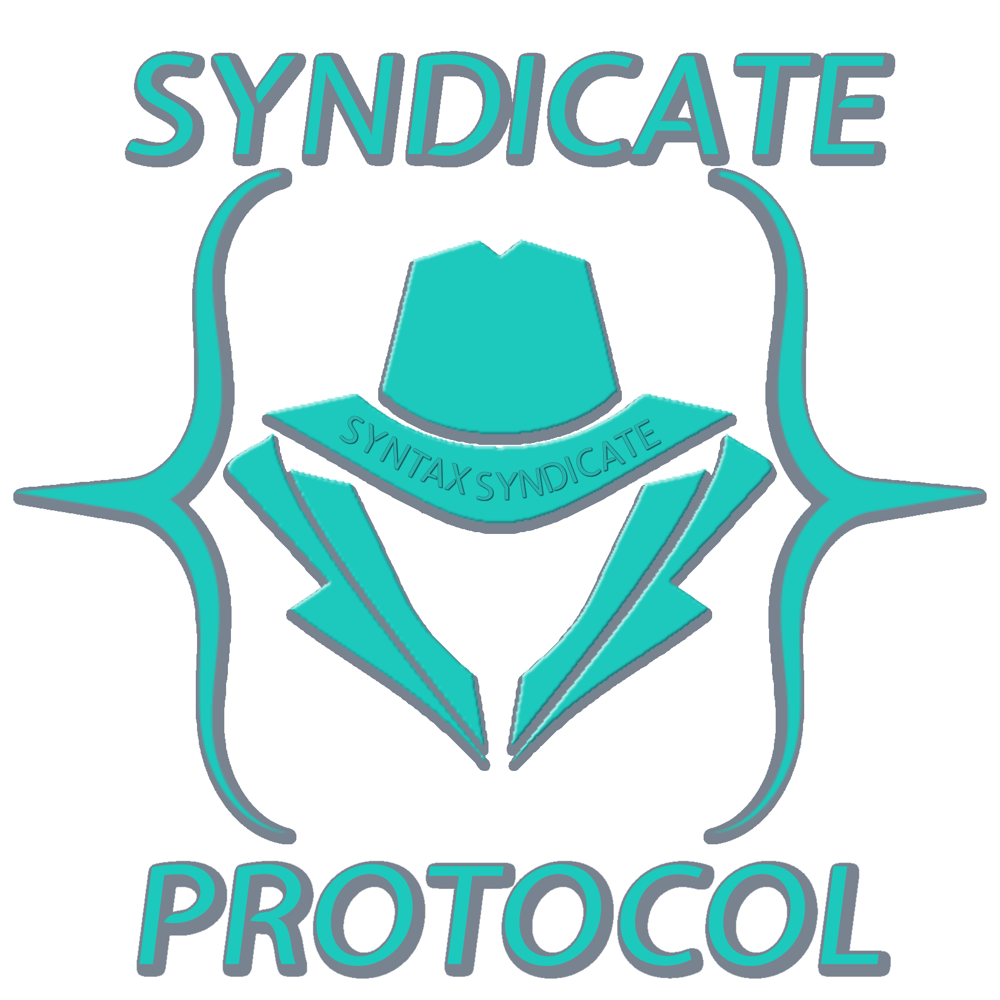
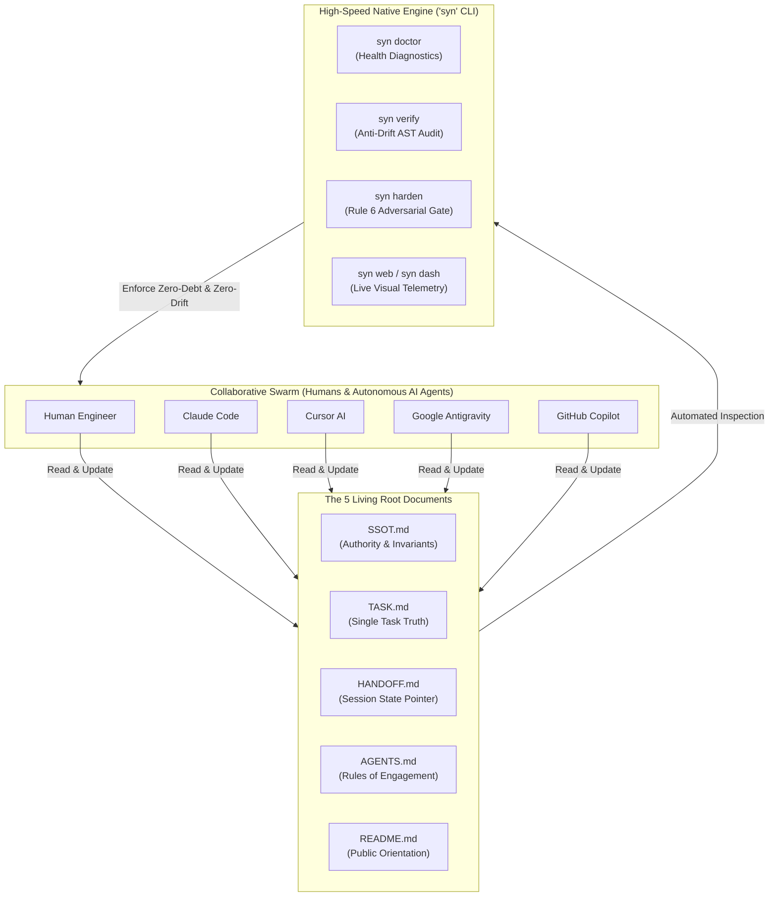
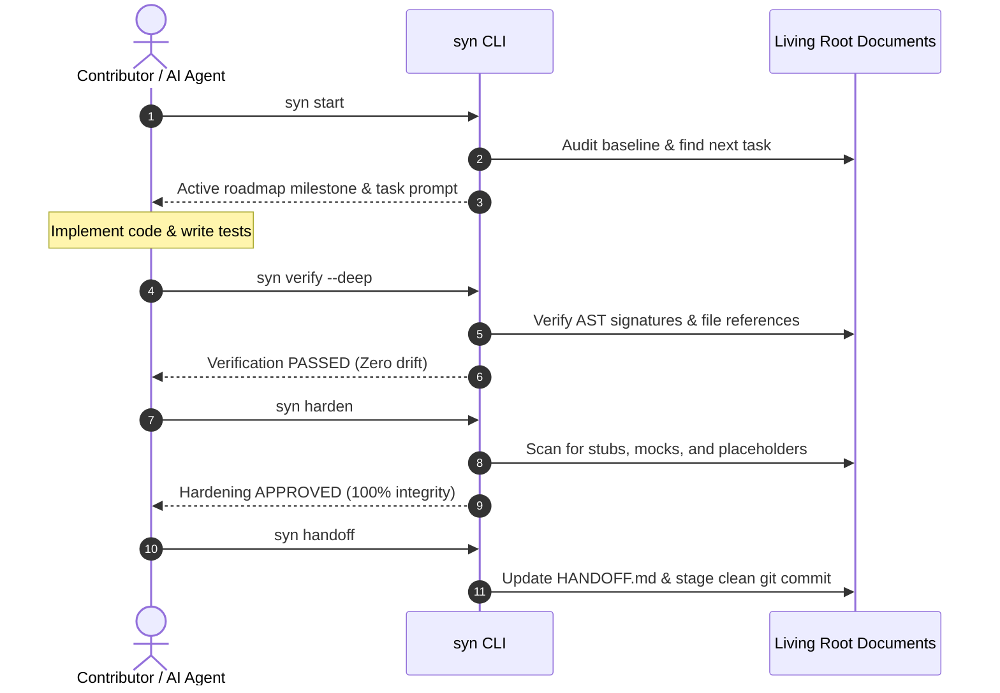

# Syndicate Protocol Documentation

[-orange.svg)](https://github.com/Syndicate-Protocol/syndicate-protocol/releases)
[-blueviolet.svg)](../LICENSE)

  

> [!IMPORTANT]
> **Public Alpha Release (`v0.2.0-alpha.2`)**:
> Welcome to the official documentation for **Syndicate Protocol**! The protocol is currently in its initial **Public Alpha** phase. All core SSOT protocols, living root document engines, multi-agent adapters, and CLI commands (`syn verify`, `syn harden`, `syn doctor`, `syn web`) are fully operational, tested, and enforced under strict zero-stub invariants.
>
> Feedback, issue reports, and community contributions are welcome as we advance toward v1.0.0.

---

## Architecture at a Glance

Syndicate Protocol establishes an automated, sub-10ms governance loop that unites human engineers and autonomous AI agents around an unshakeable Single Source of Truth.

---

## Why Syndicate Protocol?

| Capability | Standard AI Pair Programming | With Syndicate Protocol |
| --- | --- | --- |
| **Context Retention** | Lost between chat sessions or prompt limits | Persistent, unbroken continuity across sessions |
| **Task Tracking** | Hallucinated progress, duplicate trackers | Single Source of Truth (`TASK.md`); shadow trackers blocked |
| **Code Staleness** | Documentation drifts within days of code changes | AST signature analysis flags mismatched code exports |
| **Task Completion Quality** | Phantom "done" flags on stubs and mocks | Adversarial Rule 6 hardening gate halts pipelines on stubs |
| **Multi-Agent Coordination** | Agents overwrite each other's work blindly | Isolated worktrees (`syn worktree`) with atomic lease locking |
| **Tooling Footprint** | Heavy cloud lock-in or proprietary subscriptions | Zero cloud dependencies; standalone native Go binary |

---

## Quick Navigation

### 🚀 Getting Started

- [**Quickstart Guide**](./getting-started/quickstart.md) — Get up and running in under 2 minutes.
- [**Installation Guide**](./getting-started/installation.md) — Install the `syn` CLI globally on Windows, macOS, or Linux.
- [**Project Adoption**](./getting-started/adoption.md) — Adopt the protocol in an existing codebase or initialize a new project.

### 📖 Reference & Manuals

- [**CLI Command Reference**](./cli/commands.md) — Complete user guide for all `syn` CLI commands and options.
- [**Multi-Agent Integration**](./guides/multi-agent.md) — Connect Claude Code, Cursor, Antigravity, and GitHub Copilot.
- [**Cybernetic Web Dashboard**](./guides/web-dashboard.md) — Launch and navigate the embedded React 19 visual dashboard.
- [**Contributing Guide**](../CONTRIBUTING.md) — How to contribute to templates, specifications, and documentation.

---

## The Core Contributor Cycle

Every collaborative session follows a predictable, highly disciplined four-step cadence:

---

## Community, Open Access & 100% Zero-Fee Guarantee

Syndicate Protocol's templates, living documents, specifications, and documentation are 100% open and free under the [Syndicate Community Source License](../LICENSE). Pre-compiled standalone binaries are distributed free of charge for all supported operating systems.

### 🛑 Zero-Fee Guarantee & Consumer Protection Notice

There will **NEVER** be a fee, charge, paid tier, or subscription associated with Syndicate Protocol — whether directly or indirectly. The software and methodology are perpetually free.

> [!CAUTION]
> **Have you been charged or asked to pay for Syndicate Protocol?**
> If any company, vendor, or third party has charged you money for Syndicate Protocol, sold you access, or bundled it into a paid subscription or service, you have been subjected to an unauthorized violation of the Syndicate Community Source License.
>
> 1. **Request an immediate refund**: Demand a full refund from the unauthorized seller.
> 2. **Report the violation**: Please report the incident directly to our team:
>    - **Email**: `splv@syntaxsyndicate.com`
>    - **Subject**: `Syndicate Protocol License Violation`
>    *(Please include transaction receipts, vendor names, or URLs. An online reporting form will also be available on our website).*
