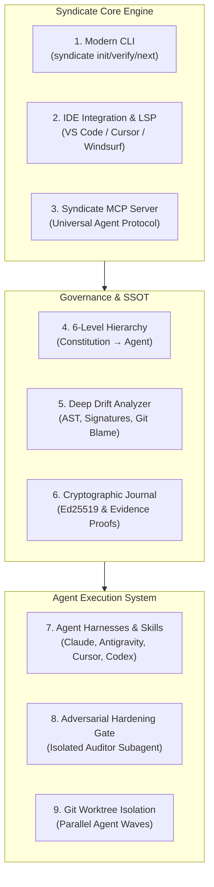

<p align="center">
  
</p>

# 🧭 Syndicate Protocol — Next-Generation Architectural Blueprint & Enhancement Roadmap

> **Mission**: Transform the Syndicate Protocol from a lightweight documentation methodology into an authoritative, developer-loved, end-to-end governance operating system for human and multi-agent software engineering.

---

## Executive Summary & Foundation

The **Syndicate Protocol** provides what the AI-assisted coding world desperately lacks: a **clear, unambiguous Authority Hierarchy** and a **strict Anti-Drift discipline** rooted in 5 living documents and Rule 6 (*"No fake complete status"*). 

However, looking across the ecosystem of modern AI engineering tools (analyzed in `.reference__items/`), methodologies succeed when they minimize friction and automate compliance:
- **Developers resist manual paperwork**: If maintaining `TASK.md` and `HANDOFF.md` requires copy-pasting, manually resolving file references, and running disparate scripts, humans skip it and agents hallucinate it.
- **Agents need native triggers**: Agents don't just read root docs unless prompted via native tool hooks, slash commands, or MCP tools.
- **Integrity must be proven, not assumed**: True anti-drift requires AST-level validation, deterministic evidence capture, and independent adversarial gates.

This blueprint details how to combine the strengths of the 25 benchmarked frameworks with the Syndicate Protocol's core philosophy.

---

## Part 1: Immediate Baseline Suggestions

Before introducing new capabilities, the existing repository requires three immediate baseline actions:

### 1. Initial Git Baseline Commit
- **Status**: Git is initialized on `master` with 0 commits.
- **Action**: Create a clean initial commit tracking `SYNDICATE_PROTOCOL.md`, `syndicate-protocol-kit/`, and `.reference__items/research.md`. Configure `.gitignore` to keep `.turbo`, temporary logs, and build artifacts clean.

### 2. Dogfooding the Protocol (Self-Hosting)
- **Status**: The repository defines the template kit in `syndicate-protocol-kit/`, but does not implement the protocol on itself.
- **Action**: Adopt the protocol directly at the repo root:
  - `SSOT.md`: Define the constitutional non-negotiables for Syndicate Protocol itself (e.g., zero telemetry without opt-in, zero external runtime lock-in, pure ESM/TypeScript, POSIX/Windows dual compatibility).
  - `TASK.md`: Track active roadmap milestones.
  - `HANDOFF.md`: Live session pointer.
  - `AGENTS.md`: Contributor rules for this repo.
  - `ssot.config.json`: Wire `scripts/verify-ssot.mjs` to run against this repo.

### 3. Packaged CLI Distribution (`@syndicate-protocol/cli`)
- **Status**: Adoption currently requires manually copying template markdown files and shell scripts.
- **Action**: Package the kit into an `npx syndicate init` / `bunx syndicate init` CLI.

---

## Part 2: Comparative Synthesis Across Reference Frameworks

Our deep inspection of the 25 reference items reveals eight distinct design schools that directly inform Syndicate Protocol:

| Reference Frameworks | Core Strengths Observed | Synergy with Syndicate Protocol |
| :--- | :--- | :--- |
| **OpenSpec**, **Spec Kit (GitHub)** | Interactive slash commands (`/opsx:propose`, `/speckit-specify`), delta specs, clear proposal-to-archive lifecycles. | Evolution of Milestone tasks in `TASK.md` into structured delta proposals under `docs/specs/` that compile into the technical spec. |
| **Spec Kitty**, **GSD-2** | Work package lifecycles (`planned` → `in_progress` → `review` → `done`), local kanban dashboards, git worktree isolation. | Running parallel coding agents in isolated `.worktrees/` without branch collision, updating `TASK.md` atomically upon wave completion. |
| **Superpowers**, **GSD Antigravity** | Role isolation, subagent delegation, Red-Green-Refactor TDD enforcement, pre-commit validation skills. | Automated execution of Syndicate Protocol's **Hardening Gate** using an isolated reviewer agent that audits `[x]` claims with fresh eyes. |
| **Drift** | AST signature parsing, Markdown code-block checking against real symbols, git history staleness scoring. | Supercharging `verify-ssot.mjs` into a deep static analysis engine that checks if README examples and docstrings match real code. |
| **Mnemoscope** | Ed25519 cryptographic signing, `prevHash` chained journal, context rot prediction, tamper detection. | Cryptographic audit trail of agent task execution; mathematical proof that tasks were verified and completed chronologically. |
| **Spec Workflow MCP**, **SpecAtlas** | Native Model Context Protocol (MCP) server, LSP server, real-time live web dashboard, VS Code extension. | Real-time visual dashboard showing SSOT hierarchy, task progress, and live drift scores; MCP tools for any AI IDE. |
| **ArchLens** | Deterministic stack detection, manifest parsing, evidence grounding, zero-secret sandboxing. | `syndicate adopt` command that scans brownfield codebases, auto-detects stack/entrypoints, and writes accurate initial living docs. |
| **AI Scrum Master**, **BMAD Method** | Agile persona orchestration, ticket breakdown, stakeholder review gates. | Structured sprint and review coordination built on top of `HANDOFF.md` without bureaucratic enterprise bloat. |

---

## Part 3: The 8 Architectural Pillars of the Enhanced Syndicate Protocol



---

### Pillar 1: The Zero-Friction Developer CLI (`syndicate-cli`)

Instead of manual file editing, provide a single zero-dependency CLI (`syndicate` or `npx @syndicate-protocol/cli`):

- `syndicate init [--stack <auto|node|python|go|rust>]`:
  - Scans workspace manifests (`package.json`, `Cargo.toml`, `pyproject.toml`, `go.mod`).
  - Auto-populates `AGENTS.md` with real build/test commands and file layout.
  - Generates `SSOT.md`, `TASK.md`, `HANDOFF.md`, and `ssot.config.json`.
  - Configures pre-commit hooks (`husky` / `lefthook` / `simple-git-hooks`).
- `syndicate verify [--strict] [--json]`:
  - Fast, multi-stage static verification (root docs, backtick file paths, test synchronization, forbidden trackers).
  - Emits machine-readable JSON for CI and agent consumption.
- `syndicate next`:
  - Inspects `HANDOFF.md` and `TASK.md` and outputs the immediate next actionable task, active blockers, and recommended start order.
- `syndicate doctor`:
  - Audits repository health: detects unlinked tests, dangling tasks, stale hand-off pointers, or missing docs.
- `syndicate handoff [--summary "..."]`:
  - Captures current git commit hash, clean/dirty working tree status, tests passing status, and prompts the user or agent to record the session summary atomically.

---

### Pillar 2: Universal Agent Adapters & Slash Commands

Following the patterns of **Superpowers**, **OpenSpec**, and **SpecAtlas**, Syndicate Protocol should compile native agent configs into each tool's native syntax:

```
.syndicate/
├── adapters/
│   ├── antigravity/    # .agents/skills/ & .agent/workflows/
│   ├── claude-code/    # .claude/commands/ & .claude/skills/
│   ├── cursor/         # .cursor/skills/
│   ├── codex/          # prompts/
│   └── gemini-cli/     # .gemini/commands/
```

#### Core Slash Commands & Skills:
1. `/syndicate:start` — Performs the 60-second onboarding sequence (§6): reads `SSOT.md`, checks `HANDOFF.md`, inspects `TASK.md`, runs verification, reports active task.
2. `/syndicate:task-done <task_id>` — Enforces Rule 2 & Rule 6: verifies real code exists on disk, runs tests, updates `TASK.md`, updates `HANDOFF.md`, and stages the commit.
3. `/syndicate:verify` — Executes the full verification gate and reports drift errors.
4. `/syndicate:handoff` — Prepares clean hand-off summary before ending the session.
5. `/syndicate:harden` — Triggers the adversarial hardening gate review.

---

### Pillar 3: Automated Adversarial Hardening Subagent

Syndicate Protocol pioneered the **Hardening Gate** pattern (Methodology §7). To make this concrete and automated:

```
[Feature Phase Complete] 
         │
         ▼
[Trigger /syndicate:harden]
         │
         ├── Spawns Isolated Subagent: "syndicate-hardening-auditor"
         │   ├── Clean context window (zero implementation chat history)
         │   ├── Reads Level 1 (Constitution), Level 2 (Requirements), Level 3 (Spec)
         │   ├── Audits every newly checked [x] task against actual disk code
         │   ├── Actively looks for:
         │   │   - Stub functions returning hardcoded/empty mocks
         │   │   - UI controls with empty onClick handlers
         │   │   - Try/catch blocks silently suppressing errors
         │   │   - Tests asserting trivial constants (e.g. expect(true).toBe(true))
         │   └── Produces HARDENING_REPORT.md with verified evidence
         ▼
[Blocks Next Milestone in TASK.md until all findings are remediated]
```

This transforms Rule 6 from an abstract guideline into an **enforced mechanical gate**.

---

### Pillar 4: Deep Anti-Drift Engine (AST & Signature Validation)

Inspired by **Drift**, upgrade `verify-ssot.mjs` from simple path checking to semantic static analysis:

1. **Code Example Verification in Documentation**:
   - Parse fenced code blocks in `README.md` and `docs/**/*.md`.
   - Validate that referenced function signatures, imports, and CLI flags match the actual codebase exports.
2. **Git Recency & Staleness Scoring**:
   - Calculate git age delta: if code files have been modified 20+ times or >14 days since their corresponding `docs/` spec or `HANDOFF.md` was updated, flag **Warning: Documentation Staleness Risk**.
3. **Task Reference Liveness**:
   - Ensure symbols (classes, methods) referenced in completed tasks are actually exported and invoked in source code, preventing dead-code stubs.

---

### Pillar 5: Real-Time Local Dashboard & MCP Server

Developers and team leads want visual observability without leaving their machine (inspired by **Spec Workflow MCP**, **Spec Kitty**, and **Mnemoscope**):

- **Zero-Dependency Local Web Dashboard (`syndicate dashboard`)**:
  - **Hierarchy Visualizer**: Interactive view of Levels 1–6 with quick navigation.
  - **Living Milestone Progress**: Interactive checklist of `TASK.md` with completion percentages, wave groupings, and blocker alerts.
  - **Live Hand-off Radar**: Shows active contributor, latest commit hash, working tree cleanliness, and immediate next tasks.
  - **Drift Health Gauge**: Real-time score (0–100%) computed by the verification engine.
- **Model Context Protocol (MCP) Server (`@syndicate-protocol/mcp`)**:
  - Exposes tools to any MCP client (Claude Desktop, Cursor, Antigravity, OpenCode, Codex):
    - `get_ssot_state`: Returns current hierarchy, active milestone, and next step.
    - `verify_integrity`: Runs `verify-ssot` and returns structured diagnostics.
    - `record_task_completion`: Safely transitions a task to `[x]` with evidence.
    - `submit_handoff`: Validates and writes `HANDOFF.md`.

---

### Pillar 6: Cryptographic Evidence & Tamper-Proof Audit Journal

Inspired by **Mnemoscope**'s signed Ed25519 hash chain:

- **Evidence Requirement for Rule 6**:
  - When marking a task `[x]`, require an evidence snippet:
    ```markdown
    - [x] **Task 1.2**: Implement JWT authentication in `src/auth/jwt.ts`
      - Evidence: `test: auth.test.ts (14 passing)`, `curl -i http://localhost:3000/auth/login -> 200 OK`
    ```
- **Local Tamper-Evident Journal (`.syndicate/journal.jsonl`)**:
  - Each task status change, hardening gate pass, or milestone sign-off is appended as a JSONL entry:
    ```json
    {
      "timestamp": "2026-09-16T12:00:00Z",
      "op": "TASK_COMPLETED",
      "task": "Task 1.2",
      "fileReferences": ["src/auth/jwt.ts"],
      "gitCommit": "abc1234",
      "agent": "gemini-3.8-flash",
      "prevHash": "e3b0c44298fc1c149afbf4c8996fb92427ae41e4649b934ca495991b7852b855",
      "hash": "8f434346648f6b96df89dda901c5176b10a6d83961dd3c1ac88b59b2dc327aa4"
    }
    ```
  - Ensures auditability in enterprise and multi-agent settings where contributors need to trace who completed what and when.

---

### Pillar 7: Delta-Spec Lifecycle & Brownfield Adoption (`syndicate adopt`)

Inspired by **OpenSpec** and **SpecAtlas**:

1. **Delta Specs for Large Features**:
   - For small tasks: work directly in `TASK.md`.
   - For major features: create a delta change folder under `docs/changes/YYYY-MM-feature-name/`:
     - `proposal.md`: Problem statement and scope.
     - `spec.md`: Delta requirements (ADDED / MODIFIED / REMOVED).
     - `tasks.md`: Detailed work breakdown.
   - Upon completion, `syndicate archive <feature>` automatically merges delta requirements into the Level 2/3 specs and moves the folder to `docs/archive/`.
2. **Brownfield Project Adoption (`syndicate adopt`)**:
   - Scanning an existing repository (e.g. 50k lines of legacy code) should not require writing specs from scratch.
   - `syndicate adopt` runs deterministic analysis (inspired by ArchLens): detects stack, maps entrypoints, infers architecture, and outputs a draft `SSOT.md`, `AGENTS.md`, and initial inventory so the team has instant governance without a two-week specification rewrite.

---

### Pillar 8: Isolated Git Worktree Execution for Multi-Agent Sprints

Inspired by **Spec Kitty** and **Superpowers**:

- When multiple agents or subagents work simultaneously:
  - Working in the same checkout causes file collisions, dirty git status, and git lock errors.
  - `syndicate worktree create <task-or-milestone>` provisions an isolated worktree under `.worktrees/<task-slug>`.
  - The agent works, tests, and commits inside the isolated worktree.
  - On task completion, `syndicate worktree merge <task-slug>` runs the verification gate against the merge target before closing the worktree.

---

## Part 4: Implementation Roadmap for Syndicate Protocol

| Phase | Milestone Name | Key Deliverables |
| :---: | :--- | :--- |
| **Phase 1** | **Repository Baseline & Dogfooding** | Initialize git repo, self-host the 5 living docs in this repo, set up `ssot.config.json` and local verification. |
| **Phase 2** | **CLI & Scaffolding Engine** | Build `@syndicate-protocol/cli` (`init`, `verify`, `next`, `doctor`, `handoff`). |
| **Phase 3** | **Universal Agent Adapters** | Build adapter compiler generating slash commands & skills for Antigravity, Claude Code, Cursor, and Codex. |
| **Phase 4** | **Hardening Gate Subagent & Audit** | Implement automated adversarial reviewer skill/workflow for Rule 6 verification. |
| **Phase 5** | **Deep Drift Engine & AST Parser** | Add signature and doc-code verification (Drift-inspired) to `verify-ssot`. |
| **Phase 6** | **MCP Server & Live Dashboard** | Launch `@syndicate-protocol/mcp` and zero-dependency local web dashboard. |
| **Phase 7** | **Delta Specs & Brownfield Ingestion** | Build `syndicate adopt` and feature delta lifecycle (`propose` → `archive`). |

---

## Conclusion

By expanding Syndicate Protocol along these eight pillars, it evolves from a **disciplined methodology** into the **industry standard operating system for AI software engineering**—preserving its minimalist soul while giving developers and agents automated, delightful tools they love using every day.
