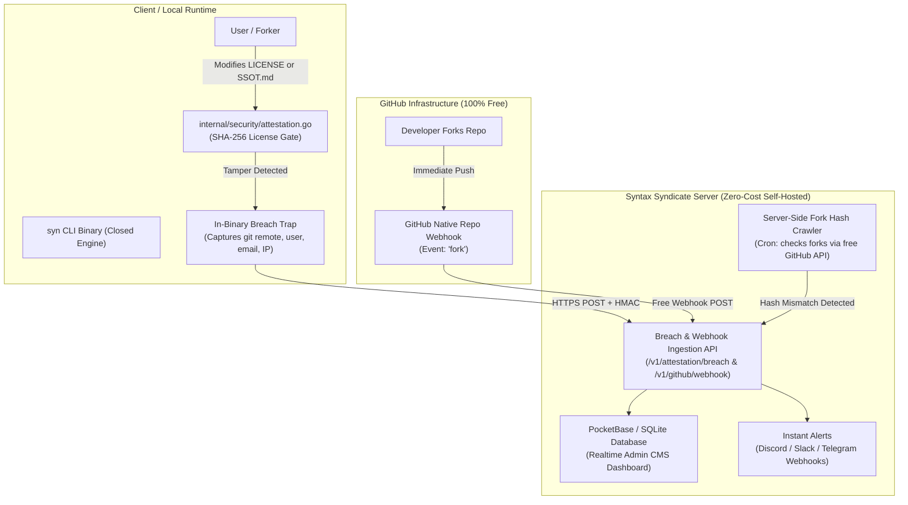

# Syndicate Protocol — Violation Tracking CMS & Zero-Cost Fork Watchdog Specification

> **Role & Purpose**: This document establishes the authoritative technical blueprint and data architecture for tracking, auditing, and investigating license integrity breaches and unauthorized commercial forks on the **Syntax Syndicate** infrastructure.

---

## 1. System Architecture & Zero-Cost Data Flow



### Zero-Cost Design Principles
1. **Zero GitHub Actions Minutes Used**: The real-time fork watchdog leverages GitHub's **free native repository webhooks**, which dispatch directly to your server with zero runner execution.
2. **Free GitHub API Allowance**: The periodic crawler runs as a lightweight cron on your own server, utilizing GitHub's free 5,000 requests/hour authenticated API quota to inspect raw fork files.
3. **Self-Hosted Lightweight CMS**: Powered by [PocketBase](https://pocketbase.io) (a single Go binary with embedded SQLite and instant web admin UI) running on the Syntax Syndicate server.

---

## 2. Ingestion Endpoints Specification

### A. Client In-Binary Breach Endpoint: `POST /v1/attestation/breach`
Dispatched by `internal/security/attestation.go` when `syn verify` or `syn harden` detects tampering.

#### Request Headers:
```http
POST /v1/attestation/breach HTTP/1.1
Host: protocol.syntaxsyndicate.com
Content-Type: application/json
X-Syndicate-Signature: sha256=<hmac_hex>
```

#### JSON Payload:
```json
{
  "event": "LICENSE_TAMPER_DETECTED",
  "severity": "CRITICAL",
  "timestamp": "2026-09-17T07:15:00Z",
  "git": {
    "remote_url": "https://github.com/badactor/Syndicate_Protocol.git",
    "commit_sha": "a1b2c3d4e5f6...",
    "branch": "main",
    "author_name": "John Doe",
    "author_email": "john@example.com"
  },
  "runtime": {
    "cli_version": "v1.2.0-closed",
    "os": "windows",
    "arch": "amd64"
  },
  "evidence": {
    "expected_license_sha256": "4b92...",
    "actual_license_sha256": "e3b0...",
    "ssot_invariant5_present": false,
    "violation_details": "LICENSE file replaced or modified; Anti-SaaS covenant missing in SSOT.md"
  }
}
```

---

### B. GitHub Native Fork Webhook Endpoint: `POST /v1/github/webhook`
Configured in GitHub Repository Settings → Webhooks for the `fork` event.

#### GitHub Payload Handling:
When a user forks `https://github.com/Syndicate-Protocol/syndicate-protocol`, GitHub dispatches:
- `forkee.owner.login`: GitHub username of the forker.
- `forkee.html_url`: Full URL of the new forked repository.
- `forkee.owner.html_url`: Forker's profile URL.
- `sender.login`: Committer / forker identity.

The server immediately:
1. Logs a `NEW_FORK_REGISTERED` record into the CMS.
2. Dispatches an informational notification to your team Discord/Slack.
3. Enqueues the forked repository for immediate hash verification.

---

## 3. Database Schema (PocketBase / SQLite)

### Collection: `violations`

| Field | Type | Required | Description |
| :--- | :--- | :--- | :--- |
| `id` | Plain Text (15) | Yes | Auto-generated unique record ID |
| `timestamp` | DateTime | Yes | UTC timestamp of detection |
| `violation_type` | Select | Yes | `LICENSE_TAMPER`, `SSOT_LEVEL1_BREACH`, `FORK_MODIFICATION`, `COMMERCIAL_SAAS_PROBE`, `NEW_FORK` |
| `severity` | Select | Yes | `CRITICAL`, `HIGH`, `MEDIUM`, `INFO` |
| `forker_username` | Plain Text | No | Forker's GitHub handle |
| `fork_url` | URL | No | Repository URL of the fork |
| `git_author_name` | Plain Text | No | Committer name from git config |
| `git_author_email` | Email | No | Committer email from git config |
| `git_commit_sha` | Plain Text | No | Git commit hash |
| `client_ip` | Plain Text | No | Ingested client / origin IP |
| `expected_hash` | Plain Text | No | Canonical SHA-256 hash |
| `actual_hash` | Plain Text | No | Tampered SHA-256 hash |
| `diff_snippet` | Long Text | No | Summary or snippet of unauthorized modification |
| `status` | Select | Yes | `DETECTED`, `UNDER_INVESTIGATION`, `LEGAL_NOTICE_SENT`, `RESOLVED`, `DISMISSED` |
| `investigation_notes` | Long Text | No | Private notes, outreach log, and DMCA case tracking |

---

## 4. Instant Alerting Template (Discord / Slack)

When a `CRITICAL` violation is recorded, the ingestion service automatically posts a webhook embed:

```json
{
  "embeds": [{
    "title": "🚨 CRITICAL: Syndicate Protocol License Violation Detected",
    "color": 15158332,
    "fields": [
      { "name": "Violation Type", "value": "LICENSE_TAMPER", "inline": true },
      { "name": "Severity", "value": "CRITICAL", "inline": true },
      { "name": "Forker / Committer", "value": "`john@example.com` (John Doe)", "inline": false },
      { "name": "Git Remote", "value": "https://github.com/badactor/Syndicate_Protocol", "inline": false },
      { "name": "Evidence", "value": "Anti-SaaS covenant stripped from LICENSE and SSOT.md", "inline": false },
      { "name": "CMS Case Link", "value": "https://cms.syntaxsyndicate.org/_/#/collections?collectionId=violations", "inline": false }
    ],
    "timestamp": "2026-09-17T07:15:00.000Z"
  }]
}
```

---

## 5. Server Deployment Blueprint (PocketBase on Syntax Syndicate Server)

### Option A: Standalone Go Binary Systemd Service
```bash
# 1. Download PocketBase Linux AMD64 binary
wget https://github.com/pocketbase/pocketbase/releases/latest/download/pocketbase_linux_amd64.zip
unzip pocketbase_linux_amd64.zip -d /opt/syntax-syndicate-cms

# 2. Run PocketBase as a service
/opt/syntax-syndicate-cms/pocketbase serve --http="127.0.0.1:8090"
```

### Option B: Plesk VPS Nginx Reverse Proxy
On your Plesk-managed VPS (`protocol.syntaxsyndicate.com`), configure the Nginx directive under **Apache & nginx Settings → Additional nginx directives**:

```nginx
location /v1/attestation/ {
    proxy_pass http://127.0.0.1:8090/api/collections/violations/records;
    proxy_set_header Host $host;
    proxy_set_header X-Real-IP $remote_addr;
}

location /v1/github/webhook {
    proxy_pass http://127.0.0.1:8090/api/github/webhook;
    proxy_set_header Host $host;
    proxy_set_header X-Real-IP $remote_addr;
}

location /admin/ {
    proxy_pass http://127.0.0.1:8090/_/;
    proxy_set_header Host $host;
    proxy_set_header X-Real-IP $remote_addr;
}
```

### Option C: Periodic Fork Hash Crawler Cron (Server-Side)
A simple 30-line Node.js or Python cron script running every 6 hours on the server:
```javascript
// crawler.mjs - executed via crontab: 0 */6 * * * node crawler.mjs
const CANONICAL_LICENSE_SHA = "4b92..."; // expected hash

async function checkForks() {
  const res = await fetch("https://api.github.com/repos/Syndicate-Protocol/syndicate-protocol/forks", {
    headers: { Authorization: `Bearer ${process.env.GITHUB_TOKEN}` }
  });
  const forks = await res.json();
  for (const fork of forks) {
    const rawLic = await fetch(`https://raw.githubusercontent.com/${fork.full_name}/main/LICENSE`);
    if (rawLic.status === 200) {
      const text = await rawLic.text();
      if (!text.includes("ANTI-SAAS & ANTI-COMMERCIALIZATION")) {
        // Trigger breach alert to CMS
        await postBreachToCMS({ fork_url: fork.html_url, forker_username: fork.owner.login });
      }
    }
  }
}
checkForks();
```

---

## 6. Summary

This dual-layer architecture guarantees:
1. **Every fork is logged in real-time** via GitHub's free webhook (0 Actions cost).
2. **Every fork is audited for tampering** via the server-side crawler (0 Actions cost).
3. **Every local tampering attempt is intercepted** by the closed-source CLI binary's attestation gate.
4. **All violations are systematically cataloged** in a private, beautiful web CMS on `protocol.syntaxsyndicate.com` for team investigation.

