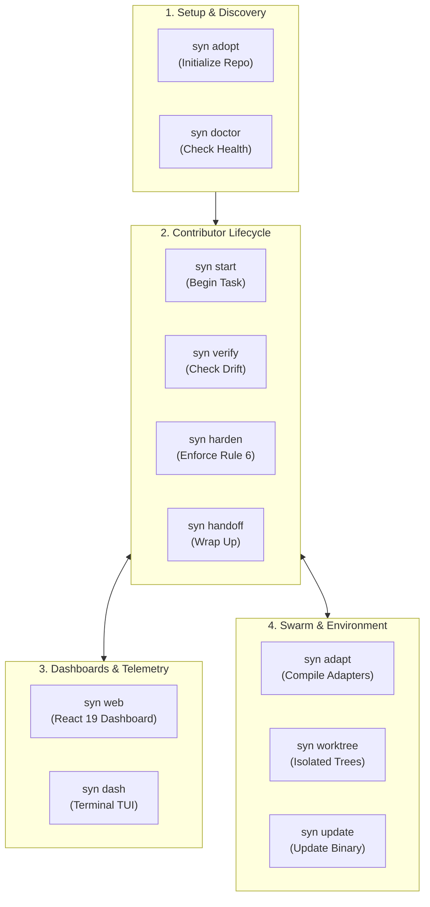

# CLI Command Reference

This document provides the authoritative user reference for all `syn` CLI commands, flags, and options.

---

## Command Lifecycle Taxonomy

The `syn` CLI commands are organized into distinct phases of the software development lifecycle:



---

## Command Matrix & Flag Reference

| Command | Primary Flags | JSON Support | Exit Code 0 | Exit Code 1 |
|---|---|---|---|---|
| [`syn doctor`](#syn-doctor) | `--fix` | No | 100% compliant | Issues or warnings detected |
| [`syn adopt`](#syn-adopt) | *(Interactive)* | No | Created successfully | Generation error |
| [`syn verify`](#syn-verify) | `--deep`, `--templates`, `--json` | Yes | Zero drift | Drift / missing file detected |
| [`syn harden`](#syn-harden) | `--json` | Yes | Zero stubs/mocks found | Fake completion detected |
| [`syn start`](#syn-start) | `--skip-verify` | No | Task selected | Pre-check failed |
| [`syn handoff`](#syn-handoff) | `--skip-verify` | No | State updated & staged | Verification failed |
| [`syn web`](#syn-web) | `--port`, `--open` | No | Running server | Port bind failure |
| [`syn dash`](#syn-dash) | *(None)* | No | Clean exit | Terminal render error |
| [`syn adapt`](#syn-adapt) | `--agent <name>` | No | Configs generated | Unknown agent specified |
| [`syn worktree`](#syn-worktree) | `create`, `list`, `remove` | Yes (`list --json`) | Success | Git worktree error |
| [`syn update`](#syn-update) | *(None)* | No | Updated in PATH | Compilation/copy failure |
| [`syn version`](#syn-version) | `-v`, `--version` | No | Version displayed | Flag error |
| [`syn scan`](#syn-scan) | `--fail-on <level>` | Yes (`--json`) | Clean / safe | Threats detected |
| [`syn bom`](#syn-bom) | `--output <file>` | Yes (`--json`) | A-BOM generated | Write failure |
| [`syn hook`](#syn-hook) | `install`, `remove` | No | Hook configured | Git error |

---

## Detailed Command Reference

### `syn doctor`

Performs a full diagnostic audit of your local repository configuration:

- Confirms presence and placement of living root documents (`SSOT.md`, `README.md`, `TASK.md`, `HANDOFF.md`, `AGENTS.md`).
- Confirms centralized documentation hub index.
- Verifies every file referenced in completed tasks exists on disk.
- Scans for unauthorized shadow trackers (`TODO.md`, `NOTES.md`).
- Checks environment PATH and active binary location.
- Audits AI skills and agent rule files for hygiene.

```bash
# Run diagnostics
syn doctor

# Run diagnostics and automatically repair remediable issues (e.g. package linter hygiene)
syn doctor --fix
```

---

### `syn adopt`

Launches the interactive project adoption wizard. Automatically detects project stack, creates living root documents, sets up `ssot.config.json`, and verifies setup.

```bash
syn adopt
```

---

### `syn verify`

Sub-10ms anti-drift verification engine. Validates living root documents, checks file references in `TASK.md`, and detects shadow trackers.

```bash
# Standard verification (<10ms)
syn verify

# Deep AST code signature audit + Git staleness analysis
syn verify --deep

# Verify living document template compliance
syn verify --templates

# Machine-readable JSON output for CI pipelines
syn verify --json
```

---

### `syn harden`

Adversarial hardening gate enforcer (Rule 6). Scans recently completed tasks in `TASK.md` and their referenced source files for unimplemented stubs, mock fallbacks, or placeholder markers (`TODO`, `FIXME`, `placeholder`, `dummyData`).

```bash
# Run adversarial hardening gate audit
syn harden

# Output structured report in JSON
syn harden --json
```

---

### `syn start`

Canonical session start command. Onboards human contributors or autonomous AI agents by inspecting active milestones, detecting the next pending task, and prompting to begin work or inspect documented innovations.

```bash
syn start
```

---

### `syn handoff`

Canonical session wrap-up command. Cleans expired worktree leases, runs automated pre-handoff verification, prompts for session hand-off notes, updates `HANDOFF.md`, and stages changes cleanly.

```bash
syn handoff
```

---

### `syn web`

Launches the embedded React 19 cybernetic dashboard on `localhost:3000` with visual telemetry, interactive task boards, dependency graphs, and a real-time web terminal bridge.

```bash
# Launch server and automatically open your default browser
syn web --open

# Launch on a specific custom port
syn web --port 8080
```

---

### `syn dash`

Launches a terminal-native full-screen TUI monitoring dashboard powered by Charm Bubble Tea, Lip Gloss, and Glamour.

```bash
syn dash
```

---

### `syn adapt`

Compiles and synchronizes governance rules, instructions, and slash commands across supported AI coding agents.

```bash
# Compile configurations for all detected agents
syn adapt

# Target a specific agent
syn adapt --agent claude
syn adapt --agent cursor
syn adapt --agent antigravity
syn adapt --agent copilot
```

---

### `syn worktree`

Manages isolated Git worktrees for concurrent, parallel multi-agent development swarms, complete with automatic lease management and cleanup.

```bash
# Create an isolated worktree for an agent
syn worktree create <branch-name>

# List active worktree leases
syn worktree list

# Remove and clean an expired worktree
syn worktree remove <branch-name>
```

---

### `syn update`

Compiles the current workspace binary and updates the globally installed binary at `~/.syndicate/bin/syn`, utilizing atomic swap mechanics to guarantee zero in-use file lock errors on Windows, macOS, and Linux.

```bash
syn update
```

---

### `syn version`

Displays the active CLI version, release channel, and build provenance:

```bash
# Standard version provenance output
syn version

# Quick shorthand flags
syn -v
syn --version
```

---

### `syn scan`

Performs an automated security audit of AI agent skill files, markdown prompts, and execution scripts for prompt injections, credential harvesting, dangerous shell executions, and exfiltration attempts.

```bash
# Scan local agent skills and instruction files
syn scan

# Return structured JSON for CI security gates
syn scan --json

# Fail pipeline if threats meet or exceed severity threshold
syn scan --fail-on HIGH
```

---

### `syn bom`

Generates an authoritative CycloneDX Agent Software Bill of Materials (A-BOM) capturing runtime tools, agents, dependencies, and SHA256 integrity hashes.

```bash
# Generate JSON A-BOM to stdout
syn bom --json

# Save A-BOM to a specific artifact file
syn bom --json --output dist/syndicate-abom.json
```

---

### `syn hook`

Installs or manages automated Git hooks enforcing SSOT verification, Rule 6 hardening, and repository health diagnostics on `git commit` and `git push`.

```bash
# Install automated pre-commit and pre-push hooks
syn hook install

# Remove automated git hooks
syn hook remove
```

