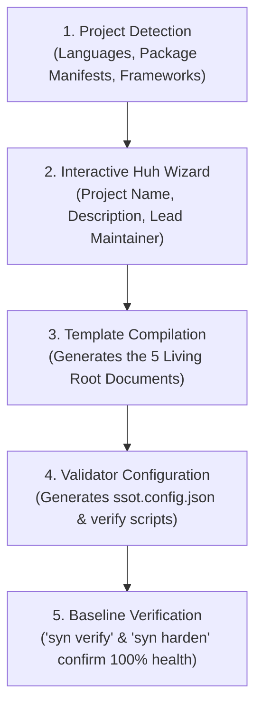

# Project Adoption Guide

You can adopt Syndicate Protocol in any codebase — new or existing — in under 60 seconds.

---

## The Adoption Pipeline



---

## Method 1: Automated Adoption via CLI (Recommended)

Navigate to your project's root folder and run:

```bash
syn adopt
```

The interactive wizard will:

1. Scan your project files to automatically detect language, package managers, and tools.
2. Ask for your project's canonical name, description, and primary maintainer.
3. Automatically generate the **5 Living Root Documents**:
   - `SSOT.md`: Single Source of Truth authority rules and architecture invariants.
   - `README.md`: Public orientation and documentation map.
   - `TASK.md`: Living task and milestone progress tracker.
   - `HANDOFF.md`: Operational hand-off state between sessions.
   - `AGENTS.md`: Contributor and AI coding agent guidelines.
4. Set up `ssot.config.json` and a lightweight Node.js/Go verification gate.

---

## The 5 Living Root Documents Authority Matrix

| Document | Precedence | Purpose | Update Frequency |
|---|---|---|---|
| [`SSOT.md`](#) | **Level 1** (Highest) | Non-negotiable architectural invariants & authority hierarchy | Seldom (major milestones) |
| [`TASK.md`](#) | **Level 2** | Exclusive truth for milestone and task completion status | Every sub-task |
| [`HANDOFF.md`](#) | **Level 3** | Operational state pointer, environment state, and next steps | End of every session |
| [`AGENTS.md`](#) | **Level 4** | Rules of engagement, coding standards, and AI behavior | Seldom (workflow evolution) |
| [`README.md`](#) | **Level 5** | Public-facing orientation, quickstart, and project map | On release / feature publish |

---

## Supported Tech Stacks & Detection Matrix

The `syn adopt` engine automatically detects project environments and configures verification scripts accordingly:

| Ecosystem | Detected Files | Configured Verifier |
|---|---|---|
| **Node.js / TypeScript** | `package.json`, `tsconfig.json`, `pnpm-lock.yaml` | `pnpm run verify:ssot` or `npm run verify:ssot` |
| **Go** | `go.mod`, `go.sum` | Native `syn verify` or `go test` |
| **Python** | `pyproject.toml`, `requirements.txt` | Native `syn verify` |
| **Rust** | `Cargo.toml`, `Cargo.lock` | Native `syn verify` |
| **Monorepo / Polyglot**| Multiple package manifests | Unified `ssot.config.json` |

---

## Method 2: Manual Template Kit Copy

If you prefer not to use the interactive CLI or want to inspect the templates first:

1. Browse the [`syndicate-protocol-kit/`](https://github.com/Syndicate-Protocol/syndicate-protocol/tree/main/syndicate-protocol-kit) directory in the repository.
2. Copy the template files into your project root:
   - `SSOT.template.md` → `SSOT.md`
   - `TASK.template.md` → `TASK.md`
   - `HANDOFF.template.md` → `HANDOFF.md`
   - `AGENTS.template.md` → `AGENTS.md`
   - `ssot.config.example.json` → `ssot.config.json`
3. Replace all `[PLACEHOLDER]` tokens with your project details.
4. Run `syn verify` to confirm your configuration is clean.

---

## What Happens After Adoption?

Once adopted:

- Your team (and any AI agents you pair with) will have a persistent, structured memory of the codebase.
- You can run `syn verify` at any time to catch documentation staleness or broken file links.
- You can run `syn harden` to prevent "fake completion" PRs before merging.
