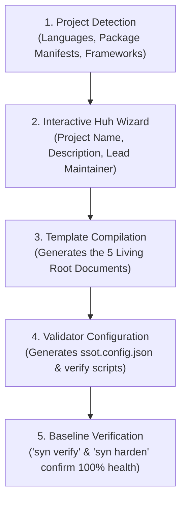
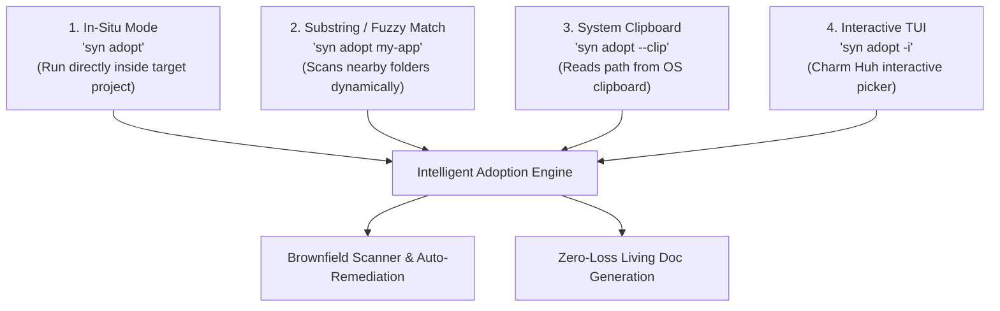

# Project Adoption Guide

You can adopt Syndicate Protocol in any codebase — new or existing — in under 60 seconds.


---

## The Adoption Pipeline



---

## Method 1: Automated Adoption via CLI (Recommended)

The `syn adopt` engine is designed to eliminate friction and finger fatigue when adopting new or brownfield projects. You never need to type out long, tedious directory paths.

### 🎯 Universal Zero-Fatigue Target Resolution

The CLI supports four ergonomic ways to target a repository:



#### 1. In-Situ Execution (Zero Arguments)
Navigate to your project's root folder and simply run:
```bash
syn adopt
```
It automatically resolves the target as the current working directory (`.`).

#### 2. Substring & Fuzzy Matching (`syn adopt <query>`)
Run from any parent, sibling, or workspace directory with a partial query:
```bash
# Finds and targets D:/projects/.../vagari-v1
syn adopt vagari

# Finds and targets ../client-portal
syn adopt portal

# Finds and targets ../../services/auth-api
syn adopt auth
```
The resolver dynamically traverses parent and sibling directories, scoring folders that contain canonical project signatures (`.git`, `package.json`, `go.mod`, `Cargo.toml`, `pyproject.toml`, `pom.xml`, etc.) and selecting the best match.

#### 3. System Clipboard Auto-Detection (`syn adopt --clip` / `-c`)
Copy a directory path to your system clipboard (e.g., via Windows File Explorer `Ctrl+Shift+C` "Copy as path" or macOS `Cmd+Opt+C`) and run:
```bash
syn adopt --clip
# or
syn adopt -c
```
The CLI automatically retrieves, trims enclosing quotes, verifies the path on disk, and executes adoption.

#### 4. Interactive TUI Project Picker (`syn adopt -i` / `--interactive`)
Discover and pick from candidate projects interactively:
```bash
syn adopt -i
```
Launches a responsive Charm `huh` terminal menu listing all discovered candidate repositories in adjacent directory trees.

---

### 🛡️ Brownfield Auto-Remediation & Zero-Loss Promotion

When adopting a project that is already deep in active development, `syn adopt` automatically protects your existing assets:

1. **Displaced Living Document Promotion (Zero-Loss Migration)**:
   - If your project already maintains nested task trackers (e.g. `docs/task.md` or `docs/tasks.md`), the engine automatically promotes it to root [`TASK.md`](#) rather than overwriting it with a blank template. All your milestone history, task checkboxes, and phase breakdowns are preserved 100%.
   - If an existing hand-off state exists (e.g. `docs/AGENT_HANDOFF.md` or `docs/handoff.md`), it is promoted to root [`HANDOFF.md`](#).
2. **`pnpm-workspace.yaml` Disambiguation**:
   - Modern single-application repositories often declare `pnpm-workspace.yaml` solely for package `overrides:` or `allowBuilds:`. The engine inspects whether active multi-package directories exist (`packages:` directive). If not, it correctly classifies the repository as a single application (`isMonorepo: false`), avoiding false monorepo assumptions.
3. **High-Severity Invariant Mining**:
   - Scans existing guidelines, architectural blueprints, and handoff notes for critical statutory, operational, or database hazards (`CRITICAL`, `NEVER RUN`, `DROP TABLE`, `STATUTORY`, `CAL. CIV. CODE`) and codifies them directly into [`SSOT.md`](#) Level 1 Constitutional Invariants.
4. **Non-Destructive Package Script Chaining**:
   - If your `package.json` already defines a `verify` script (e.g. `npm test` or `turbo run lint`), `syn adopt` chains them non-destructively (`"verify": "pnpm run verify:ssot && <original_verify>"`).
5. **Specification Relocation**:
   - Displaced specification files residing at root are moved into the centralized `docs/` hub to enforce the 5-living-root-files invariant.

---

### Adoption Flags & Options

| Flag | Shorthand | Type | Description |
|---|---|---|---|
| `--clip` | `-c` | `bool` | Adopt repository path directly from the OS system clipboard |
| `--interactive` | `-i` | `bool` | Interactively browse and select candidate projects via Charm Huh TUI |
| `--name` | `-n` | `string` | Specify custom canonical project name |
| `--yes` | `-y` | `bool` | Non-interactive mode (auto-confirm all adoption defaults) |

---

## The 5 Living Root Documents Authority Matrix

| Document | Precedence | Purpose | Update Frequency |
|---|---|---|---|
| [`SSOT.md`](#) | **Level 1** (Highest) | Non-negotiable architectural invariants & authority hierarchy | Seldom (major milestones) |
| [`TASK.md`](#) | **Level 2** | Exclusive truth for milestone and task completion status | Every sub-task |
| [`HANDOFF.md`](#) | **Level 3** | Operational state pointer, environment state, and next steps | End of every session |
| [`AGENTS.md`](#) | **Level 4** | Rules of engagement, coding standards, and AI behavior | Seldom (workflow evolution) |
| [`README.md`](#) | **Level 5** | Public-facing orientation, quickstart, and project map | On release / feature publish |

---

## Supported Tech Stacks & Detection Matrix

The `syn adopt` engine automatically detects project environments and configures verification scripts accordingly:

| Ecosystem | Detected Files | Configured Verifier |
|---|---|---|
| **Node.js / TypeScript** | `package.json`, `tsconfig.json`, `pnpm-lock.yaml` | `pnpm run verify:ssot` or `npm run verify:ssot` |
| **Go** | `go.mod`, `go.sum` | Native `syn verify` or `go test` |
| **Python** | `pyproject.toml`, `requirements.txt` | Native `syn verify` |
| **Rust** | `Cargo.toml`, `Cargo.lock` | Native `syn verify` |
| **Monorepo / Polyglot**| Multiple package manifests | Unified `ssot.config.json` |

---

## Method 2: Manual Template Kit Copy

If you prefer not to use the interactive CLI or want to inspect the templates first:

1. Browse the [`syndicate-protocol-kit/`](https://github.com/Syndicate-Protocol/syndicate-protocol/tree/main/syndicate-protocol-kit) directory in the repository.
2. Copy the template files into your project root:
   - `SSOT.template.md` → `SSOT.md`
   - `TASK.template.md` → `TASK.md`
   - `HANDOFF.template.md` → `HANDOFF.md`
   - `AGENTS.template.md` → `AGENTS.md`
   - `ssot.config.example.json` → `ssot.config.json`
3. Replace all `[PLACEHOLDER]` tokens with your project details.
4. Run `syn verify` to confirm your configuration is clean.

---

## ⚖️ License Sovereignty for Adopted Projects

When you adopt Syndicate Protocol into an existing or new project (e.g., a commercial product, a client website, or an open-source library):

1. **Your Project Keeps Its Own License**:
   The **Syndicate Community Source License** governs only the Syndicate Protocol software itself (`syn` binary, CLI engine, and protocol source code). Adopting Syndicate Protocol does **not** relicense your project.
2. **Permitted Development & Governance Use**:
   Under Section 1(c) ("Internal Use") and Section 2(b) ("Permitted Uses"), using Syndicate Protocol to govern, verify, and streamline development workflows is 100% free and permitted.
3. **Full Freedom of Licensing**:
   Your repository maintains 100% license sovereignty. You can use **Proprietary / All Rights Reserved**, **MIT**, **Apache 2.0**, **BSD**, **GPL**, or no license at all.
4. **No Invariant 5 Requirement**:
   Your [`SSOT.md`](#) does not need Syndicate Protocol's Level 1 Invariant 5 (Anti-SaaS covenant). You define your own constitutional invariants that match your business, product, and architectural requirements.
5. **Verification Awareness**:
   The `syn verify` and `syn harden` engines automatically detect that your repository is an adopted project and affirm your license sovereignty without warnings or penalties:
   ```bash
   ✅ [VALID] License Sovereignty: Adopted project governed under Section 2(b) Permitted Development Use (License: Proprietary / All Rights Reserved)
   ```

---

## What Happens After Adoption?

Once adopted:

- Your team (and any AI agents you pair with) will have a persistent, structured memory of the codebase.
- You can run `syn verify` at any time to catch documentation staleness or broken file links.
- You can run `syn harden` to prevent "fake completion" PRs before merging.

