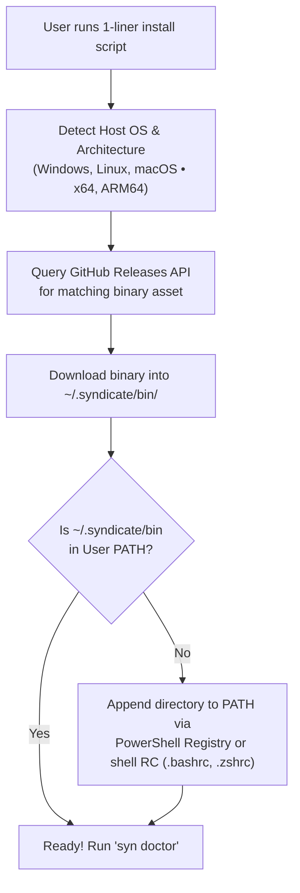

# Installation Guide

Syndicate Protocol is distributed as a single, zero-dependency standalone binary (`syn`) for Windows, macOS, and Linux across Intel/AMD and ARM architectures.


---

## Supported Operating Systems & Architectures

| Operating System | Architecture | Binary Asset | Supported Channels |
|---|---|---|---|
| **Windows 10 / 11 / Server** | AMD64 (x86_64) | `syn-windows-amd64.exe` | Stable, Beta, Alpha |
| **Windows 11 on ARM** | ARM64 (Snapdragon) | `syn-windows-arm64.exe` | Stable, Beta, Alpha |
| **macOS 12+ (Apple Silicon)** | ARM64 (M1/M2/M3/M4) | `syn-darwin-arm64` | Stable, Beta, Alpha |
| **macOS 10.15+ (Intel)** | AMD64 (x86_64) | `syn-darwin-amd64` | Stable, Beta, Alpha |
| **Linux (Debian/Ubuntu/RHEL)** | AMD64 (x86_64) | `syn-linux-amd64` | Stable, Beta, Alpha |
| **Linux (Raspberry Pi/ARM64)**| ARM64 (aarch64) | `syn-linux-arm64` | Stable, Beta, Alpha |

---

## Installer Execution Flow



---

## Automated Global Installation

### Windows (PowerShell)

Open PowerShell and execute:

```powershell
irm https://raw.githubusercontent.com/Syndicate-Protocol/syndicate-protocol/main/scripts/install.ps1 | iex
```

To install an experimental or pre-release channel (e.g. `alpha` or `beta`):

```powershell
& ([scriptblock]::Create((irm https://raw.githubusercontent.com/Syndicate-Protocol/syndicate-protocol/main/scripts/install.ps1))) -Channel alpha
```

### macOS & Linux (Bash)

Open terminal and execute:

```bash
curl -fsSL https://raw.githubusercontent.com/Syndicate-Protocol/syndicate-protocol/main/scripts/install.sh | bash
```

To install an experimental or pre-release channel:

```bash
curl -fsSL https://raw.githubusercontent.com/Syndicate-Protocol/syndicate-protocol/main/scripts/install.sh | bash -s -- --channel alpha
```

---

## Installation Directory Layout

The installer copies the binary into a centralized user directory:

```text
~/.syndicate/
├── bin/
│   └── syn (or syn.exe on Windows)
└── features.json (persistent feature flag overrides)
```

If you need to manually configure your environment PATH:

```bash
# Bash / Zsh
export PATH="$HOME/.syndicate/bin:$PATH"

# PowerShell
$env:PATH += ";$HOME\.syndicate\bin"
```

---

## Verifying Installation

Verify that the CLI is accessible and healthy:

```bash
# Check version and VCS commit provenance
syn --version

# Run full diagnostic doctor suite
syn doctor
```

---

## Updating the CLI

When a new version is released, you can update directly via the CLI:

```bash
syn update
```

---

## 🛑 Zero-Fee Guarantee: Never Pay for Syndicate Protocol

Syndicate Protocol is 100% free software. There will **NEVER** be a fee, charge, paid tier, or subscription associated with Syndicate Protocol, directly or indirectly.

> [!CAUTION]
> If any vendor or service has charged you money or requested a subscription for Syndicate Protocol, demand an immediate refund and report the unauthorized violation to:
>
> - **Email**: `splv@syntaxsyndicate.com`
> - **Subject**: `Syndicate Protocol License Violation`
