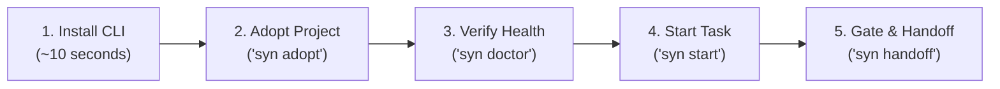

# Quickstart Guide

Get up and running with Syndicate Protocol in your terminal in under 2 minutes.


---

## The Quickstart Journey



---

## 1. Install the CLI

Install the native `syn` CLI globally with a single command:

### Windows (PowerShell)

```powershell
irm https://raw.githubusercontent.com/Syndicate-Protocol/syndicate-protocol/main/scripts/install.ps1 | iex
```

### macOS & Linux (Bash)

```bash
curl -fsSL https://raw.githubusercontent.com/Syndicate-Protocol/syndicate-protocol/main/scripts/install.sh | bash
```

Verify your installation:

```bash
syn --version
```

---

## 2. Initialize in Any Project

Run `syn adopt` directly inside your project, or target it effortlessly from anywhere:

```bash
# Option A: In-situ adoption (run inside project directory)
syn adopt

# Option B: Substring fuzzy match from anywhere (e.g. D:/projects/client-app)
syn adopt client-app

# Option C: Adopt path copied to clipboard
syn adopt --clip

# Option D: Interactive TUI picker
syn adopt -i
```

The interactive engine automatically:

1. Detects your project's technology stack (TypeScript, Go, Python, Rust, etc.).
2. Protects existing brownfield assets by promoting displaced living documents (`docs/task.md` → `TASK.md`, `docs/AGENT_HANDOFF.md` → `HANDOFF.md`) and mining high-severity invariants into `SSOT.md`.
3. Bootstraps the **5 Living Root Documents** tailored to your project.
4. Configures non-destructive automated verification scripts (`ssot.config.json`).

---

## 3. Verify Repository Health

Run the diagnostic scanner to verify that your repository is configured properly:

```bash
syn doctor
```

Run anti-drift verification:

```bash
syn verify
```

---

## 4. Daily Contributor Workflow

Every session follows a predictable four-step cadence:

```bash
# 1. Onboard / Resume: Inspect active tasks and orient yourself
syn start

# 2. Develop your feature or bug fix...

# 3. Verify documentation & code alignment
syn verify --deep
syn harden

# 4. Wrap up session: Prepare hand-off state for the next contributor
syn handoff
```

---

## Quickstart Command Summary

| Phase | Command | What It Does | Typical Time |
|---|---|---|---|
| **Setup** | `syn adopt` | Scans tech stack and bootstraps living documents | ~30s |
| **Diagnostics** | `syn doctor` | Validates repository health, path, and security | <1s |
| **Session Start** | `syn start` | Onboards agent/human, surfaces active tasks | <1s |
| **Anti-Drift** | `syn verify` | AST signature audit and file reference validation | <15ms |
| **Integrity** | `syn harden` | Adversarial scan for unfinished stubs and mocks | <50ms |
| **Session End** | `syn handoff` | Cleans worktrees, updates state, and stages git | ~5s |

---

## Next Steps

- [Deep Dive into CLI Commands](../cli/commands.md)
- [Configure Multi-Agent AI Swarms](../guides/multi-agent.md)
- [Launch the Cybernetic Web Dashboard](../guides/web-dashboard.md)
