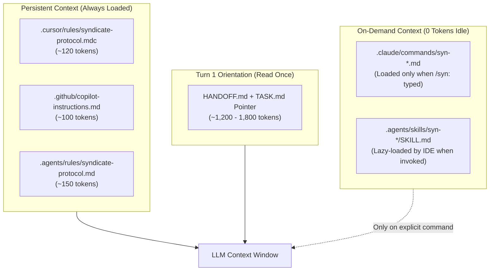
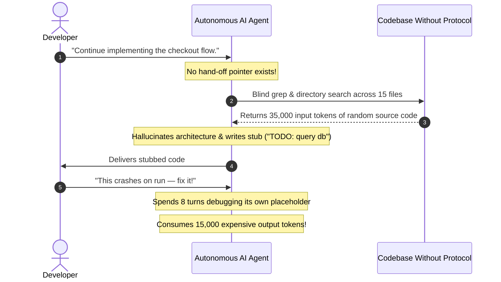

# 💰 LLM Token Economics & Cost ROI

A primary question engineering leaders and developers ask before adopting Syndicate Protocol is:  
**Will this bloat the context window and drive up developer LLM API bills?**

The empirical answer is **No — in real-world multi-turn agent sessions, Syndicate Protocol delivers a significant *net reduction* in total token spend (typically 30% to 65% cost savings per session).**

While Syndicate Protocol introduces a tiny, predictable baseline context (~120 to 150 tokens of persistent rules), it systematically eliminates the massive, compounding "invisible token leaks" where developer money actually burns: **exploratory context thrashing**, **stub/placeholder debugging loops**, and **multi-turn architectural drift**.

Furthermore, **the entire Syndicate CLI toolchain (`syn verify`, `syn harden`, `syn doctor`, `syn triage`) runs 100% locally in compiled Go with $0.00 in LLM API fees.**

---

## 1. The Actual Token Footprint of Syndicate Protocol

Syndicate Protocol's multi-agent adapters are engineered for extreme token minimalism. They provide crisp, unambiguous directives rather than sprawling text prompts.

| Agent Ecosystem | Injected File | File Size / Lines | Token Footprint | Loading Behavior |
| :--- | :--- | :--- | :--- | :--- |
| **Cursor** | `.cursor/rules/syndicate-protocol.mdc` | 15 lines (~500 B) | **~120 tokens** | Persistent system prompt rule |
| **GitHub Copilot** | `.github/copilot-instructions.md` | 12 lines (~400 B) | **~100 tokens** | Persistent workspace instructions |
| **Antigravity** | `.agents/rules/syndicate-protocol.md` | 18 lines (~650 B) | **~150 tokens** | Persistent workspace rule |
| **Claude Code** | `.claude/commands/syn-*.md` | 5 small files | **0 tokens** (idle) | **On-demand only** (only loads when `/syn:<cmd>` is invoked) |
| **Antigravity Skills** | `.agents/skills/syn-*/SKILL.md` | 5 small files | **0 tokens** (idle) | **On-demand only** (lazy-loaded by IDE when invoked) |
| **Session Start Reading** | `SSOT.md` + `HANDOFF.md` pointer | ~100–180 lines | **~1,200 – 1,800 tokens** | Read **once** at the start of a session |

> [!NOTE]
> **Context Baseline**: The permanent persistent overhead added to an agent session is **~100 to 150 tokens** — less than **0.07%** of a standard 200,000-token context window.

---

## 2. The 4 Invisible Token Leaks Eliminated by Syndicate

To understand why Syndicate Protocol saves money, consider what happens in an ungoverned repository:

### Leak 1: The "Exploratory Context Thrashing" Tax
- **Without Syndicate**: The agent has no definitive hand-off pointer. It reads dozens of source files across multiple folders to piece together what was built last.
- **With Syndicate**: The agent reads `HANDOFF.md` (1–2 pages) and `TASK.md` in turn 1. It immediately knows:
  - Exact active commit
  - Exact completed files
  - Exact next task to execute  
  **No blind grepping or directory dumping required (saving 20,000 – 50,000 input tokens per session).**

### Leak 2: The "Output Token Generation" Tax
- **Output tokens cost 3x to 5x more than input tokens** (e.g., Anthropic Claude 3.5 Sonnet costs $3/MTok input vs. **$15/MTok output**; OpenAI GPT-4o costs $2.50/MTok input vs. **$10/MTok output**).
- When an agent writes code based on hallucinated architecture or outdated patterns, the developer must prompt: *"No, we use X, not Y. Rewrite this."*
- Regenerating 400 lines of code burns ~2,000 output tokens ($0.03 to $0.06) per correction turn.
- `SSOT.md` provides explicit non-negotiable tech stack and architectural invariants upfront, stopping rewrite cycles before they happen.

### Leak 3: The "Stub / Placeholder Debugging Loop" Tax (Rule 6 Savings)
- A common failure mode of coding agents is writing `// TODO: implement later` or `return { status: "ok" } /* mock */`.
- Five turns later, downstream modules crash because of the stub. The agent spends 10–15 turns and 80,000 tokens trying to debug why data is missing, unaware that it mocked it itself.
- **Rule 6** strictly forbids stubs and fake data from being marked complete. Tasks stay open until real code exists, eliminating phantom bug loops.

### Leak 4: The "Recursive Loop / Rabbit Hole" Tax
- Ungoverned agents frequently fall into recursive loops: while working on a feature, they notice 5 other things that could be improved, veer off track, rewrite unrelated files, and exhaust the context window.
- Syndicate's **Decoupled SEFN Architecture** (`docs/INNOVATION.md`) mandates that any ideas or enhancements discovered during a task are simply logged into `docs/INNOVATION.md` and NOT implemented until deliberately promoted. The agent stays strictly scoped to the active task.

---

## 3. The Prompt Caching Multiplier (80% to 90% Cost Discounts)

Modern frontier LLM providers (Anthropic Claude, OpenAI, Google Gemini) use **Prompt Caching**:

| Provider | Cache Read Discount | Condition for Cache Hit |
| :--- | :--- | :--- |
| **Anthropic (Claude 3.5 Sonnet)** | **90% discount** ($0.30/MTok vs $3.00/MTok) | Context prefix must be identical across requests |
| **OpenAI (GPT-4o)** | **50% discount** ($1.25/MTok vs $2.50/MTok) | 1,024+ token prefix identical across requests |
| **Google (Gemini 1.5/2.0)** | **75% discount** | Shared cached system context |

### How Syndicate Maximizes Cache Hits:
- Because `SSOT.md`, `AGENTS.md`, and `.cursor/rules/` are **deterministic, structured markdown files** located at the root of the workspace, their token sequences remain stable across turns.
- In multi-turn agent sessions, these governance tokens hit the prompt cache on every subsequent turn, costing virtually nothing (cents per million tokens).

---

## 4. Local Go Engine: Zero Cloud & Zero LLM API Overhead

Crucially, **the verification and enforcement of Syndicate Protocol does NOT rely on LLMs**:

- `syn verify`: High-speed AST parsing and file checking executed in **sub-10ms** on the local CPU in native Go.
- `syn harden`: Regex/AST scanning for stubs (`TODO`, `FIXME`, `mock`, `placeholder`) running in **sub-15ms** on the local CPU.
- `syn doctor`: Filesystem integrity and shadow tracker sweeps running locally.
- `syn triage`: Git diff AST blast-radius calculation running locally.

No LLM API keys are called, no external network payloads are sent, and no token billing is incurred to run any protocol check.

---

## 5. Token & Cost Comparison Matrix (20-Turn Agent Task)

Realistic side-by-side cost projection for a standard feature implementation across a 20-turn agent session using **Claude 3.5 Sonnet**:

| Metric | Without Syndicate Protocol | With Syndicate Protocol | Net Impact |
| :--- | :--- | :--- | :--- |
| **Persistent Rules Context** | 0 tokens | ~120 tokens | +120 tokens |
| **Orientation Tokens (Turn 1)** | ~25,000 tokens (reading 10+ random files) | ~1,500 tokens (`HANDOFF.md` + `TASK.md`) | **-23,500 tokens** |
| **Average Turns to Completion** | 18 – 24 turns (due to drift & rewrites) | 8 – 12 turns (clean, scoped focus) | **~50% fewer turns** |
| **Input Tokens (compounded over session)** | ~380,000 input tokens | ~140,000 input tokens | **-240,000 input tokens** |
| **Output Tokens (code generation + fixes)** | ~14,000 output tokens | ~5,500 output tokens | **-8,500 output tokens** |
| **Prompt Cache Hit Rate** | ~35% (volatile exploratory context) | **~85%** (stable document anchors) | **2.4x higher cache hits** |
| **Estimated LLM API Cost per Task** | **~$1.85 – $2.40** | **~$0.60 – $0.85** | **60% – 68% Cost Reduction** |

---

## 6. Summary: The Business Case for Adoption

> **Adopting Syndicate Protocol directly pays for itself.**  
> By investing **~120 tokens** in clear rules and **~1,500 tokens** in structured hand-off state, engineering teams prevent agents from burning **tens of thousands of tokens** on exploratory blind searches, stub debugging loops, architectural rewrites, and out-of-scope rabbit holes.
