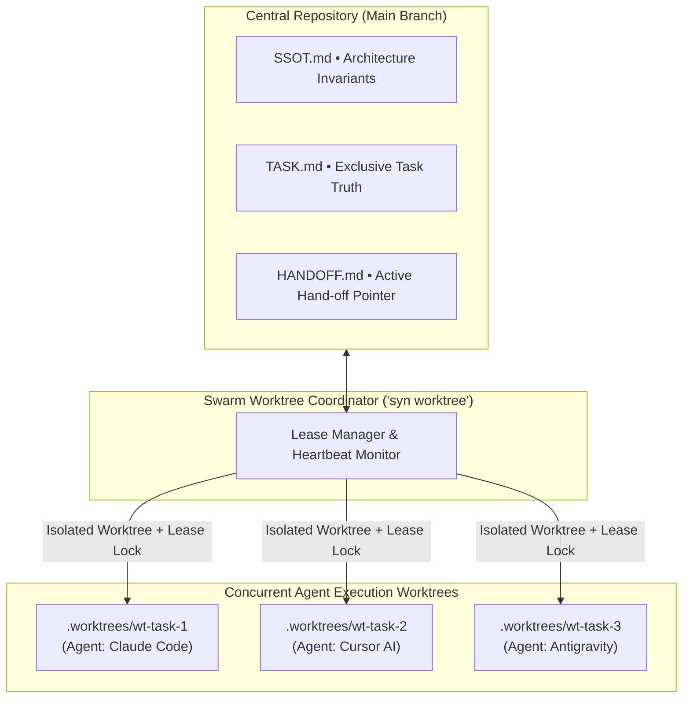

# Multi-Agent Integration Guide

Syndicate Protocol is designed from the ground up for multi-agent software engineering, ensuring consistent context, zero drift, and unified governance across different AI coding environments.


---

## Multi-Agent Swarm Topology

When multiple AI agents collaborate simultaneously, Syndicate Protocol coordinates them through isolated Git worktrees and a shared Single Source of Truth:



---

## Supported Agents & Capability Matrix

| Agent / IDE | Integration Mechanism | Custom Slash Commands | Context Memory | Worktree Support |
|---|---|---|---|---|
| **Claude Code** | Native commands (`.claude/commands/`) | `/syn-start`, `/syn-verify`, `/syn-harden`, `/syn-handoff` | High (via HANDOFF.md) | Full |
| **Cursor** | MDC rules (`.cursor/rules/`) | Inline rules via `@syndicate-protocol` | High (via SSOT.md) | Full |
| **Google Antigravity** | Agent skills (`.agents/skills/`) | Interactive skills & hooks | High (via memory KI) | Full |
| **GitHub Copilot** | Workspace rules (`.github/copilot-instructions.md`) | Context instructions | Moderate | Full |
| **OpenAI Codex** | Contributor guidelines (`AGENTS.md`) | Markdown standards | Moderate | Full |

---

## Compiling Configurations

You can generate all necessary configuration files for your workspace in one step:

```bash
syn adapt
```

This inspects your project, detects installed agents, and generates tailored instruction files so that every agent immediately understands:

1. The constitutional authority of `SSOT.md`.
2. How to consult `TASK.md` before writing code.
3. How to record session transitions in `HANDOFF.md`.
4. The strict requirement of Rule 6 (no mocks or stubs).

To generate configurations for a specific agent:

```bash
syn adapt --agent claude
syn adapt --agent cursor
syn adapt --agent antigravity
syn adapt --agent copilot
```

---

## Using Slash Commands in Claude Code

When working with Claude Code, the following commands are available directly in your chat:

| Slash Command | What It Does | When to Use |
|---|---|---|
| `/syn-start` | Runs baseline verification, inspects active tasks, and prompts next task | At the beginning of every session |
| `/syn-verify` | Runs deep AST anti-drift check and validates file references | Before committing any code |
| `/syn-harden` | Executes adversarial Rule 6 audit checking for stubs and fake completions | Before marking any task complete |
| `/syn-handoff` | Wraps up the active session, updates `HANDOFF.md`, and stages git changes | At the end of every session |

---

## Parallel Agent Development with Worktrees

When running multiple AI agents concurrently on different features, use `syn worktree` to provide each agent with an isolated working copy:

```bash
# Spawn an isolated worktree for an agent
syn worktree create feature/user-auth

# Inspect all active worktrees and leases
syn worktree list

# Clean up once the worktree branch is merged
syn worktree remove feature/user-auth
```
