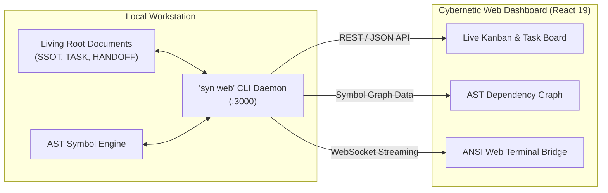

# Cybernetic Web Dashboard Guide

Syndicate Protocol embeds a high-performance **React 19 + Tailwind CSS + Vite** visual dashboard directly inside the standalone CLI binary.


---

## Web Dashboard Architecture

The dashboard runs locally with zero external server dependencies, serving embedded static assets and a real-time terminal bridge over local WebSockets:



---

## Launching the Dashboard

To launch the dashboard and automatically open it in your default web browser, run:

```bash
syn web --open
```

By default, the server runs on `http://localhost:3000`. You can customize the port:

```bash
syn web --port 8080 --open
```

---

## Dashboard Views & Features

| View | Primary Purpose | Capabilities |
|---|---|---|
| **Kanban Task Board** | Track project milestones & tasks | Live filtering, epistemic state badges, task details |
| **Living Document Inspector** | Real-time markdown viewer | Render `SSOT.md`, `HANDOFF.md`, and `AGENTS.md` |
| **AST Symbol Explorer** | Visual code relationship graph | Inspect exported symbols, functions, and cross-file references |
| **Agent Swarm Telemetry** | Multi-agent coordination | Active worktree list, lease heartbeat status, and TTL |
| **Web Terminal Bridge** | Execute commands from browser | Real-time ANSI streaming, command history, and local security |

---

## Cybernetic Visual Themes

The dashboard includes four custom-engineered dark mode cybernetic presets tailored for high readability:

| Theme Preset | Primary Accent | Visual Characteristic |
|---|---|---|
| **Cyan (Default)** | Electric Cyan (`#00f0ff`) | Futuristic anti-drift operations terminal |
| **Violet** | Deep Neon Purple (`#a855f7`) | Ambient low-fatigue nighttime engineering |
| **Emerald** | Matrix Green (`#10b981`) | Classic cybernetic telemetry console |
| **Amber** | Warm Goldenrod (`#f59e0b`) | High-contrast industrial heads-up display |

---

## Security & Privacy Protections

- **100% Localhost Execution**: The web server binds exclusively to `localhost` / `127.0.0.1`.
- **Zero Cloud Telemetry**: No project code, telemetry, or analytics are ever transmitted to any remote servers.
- **Local Origin Verification**: Mutating REST endpoints and the terminal bridge strictly validate request headers to prevent browser-based DNS rebinding and cross-site attacks.
