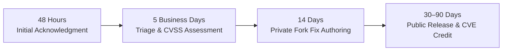

# Security Policy & Vulnerability Reporting

Syndicate Protocol provides a secure, hardened governance loop for autonomous AI agents and engineering teams. This document establishes our supported release versions, confidential disclosure mechanisms, response SLAs, and vulnerability scope.

---

## 1. Supported Versions

Active security updates and vulnerability patches are provided for the following releases:

| Version | Release Channel | Supported | Notes |
| :--- | :--- | :---: | :--- |
| `0.2.x-alpha` | **Alpha Early Access** | ✅ | Current active line; receives rapid security hotfixes. |
| `< 0.2.0` | **Pre-Alpha / Prototype** | ❌ | Deprecated early releases; upgrade immediately to latest. |

---

## 2. Reporting a Vulnerability

If you have discovered a potential security vulnerability in Syndicate Protocol, **please do not disclose it publicly or open a public GitHub issue.**

Please report all vulnerabilities confidentially through one of our two dedicated channels:

### 🔒 Option A: GitHub Private Vulnerability Reporting (Preferred)

We utilize GitHub's native **Private Vulnerability Reporting** portal. Submissions are end-to-end encrypted and visible solely to our core maintainers:

👉 **[Submit a Confidential Vulnerability Report](https://github.com/Syndicate-Protocol/syndicate-protocol/security/advisories/new)**

1. Navigate to the link above (or click **Security -> Report a vulnerability** on GitHub).
2. Enter the summary, affected component, and CVSS severity estimate.
3. Provide a clear Proof of Concept (PoC) with step-by-step reproduction instructions.
4. Click **Submit report**. A secure collaboration channel will be provisioned automatically.

---

### ✉️ Option B: Direct Security Contact (Fallback)

If you prefer direct email communication:

- **Email**: [`security@syntaxsyndicate.com`](mailto:security@syntaxsyndicate.com)
- **Subject**: `[SECURITY VULNERABILITY] <Component>: 
`
- Please include reproduction steps, environment details (OS, architecture, CLI version), and remediation suggestions.

> [!NOTE]
> **Reporting License & Commercialization Violations**:
> For reports involving unauthorized commercial paywalls, SaaS hosting, or license breaches under the Syndicate Community Source License, please contact: **[`splv@syntaxsyndicate.com`](mailto:splv@syntaxsyndicate.com)** with the subject line *'Syndicate Protocol License Violation'*.

---

## 3. Coordinated Disclosure SLAs

- **48 Hours**: Receipt acknowledgment and coordinator assignment.
- **5 Business Days**: Exploitability triage, impact verification, and CVSS v3.1 scoring.
- **14 Days**: Patch authoring in a private collaboration fork with reporter validation.
- **30–90 Days**: Coordinated release of patched standalone binaries across all 6 architectures, accompanied by a public GitHub Security Advisory and CVE credit.

---

## 4. Scope & Safe Harbor

### In-Scope Architectures
- **Native CLI (`syn`)**: Execution privilege bounds, path traversal defenses, arbitrary file overwrite guards.
- **Cybernetic Web Dashboard (`syn web`)**: Localhost origin enforcement (`isLocalOrigin`), DNS rebinding protection, CSRF prevention, and WebSocket terminal bridge isolation.
- **Multi-Agent Compilers (`syn adapt`)**: Shell injection sanitization across Claude, Cursor, Antigravity, Copilot, and Codex configs.
- **Supply Chain Integrity**: Standalone binary cryptographic verification (`checksums.txt`) and CycloneDX Architecture Bill of Materials (`syndicate-abom.json`).

### Safe Harbor Guarantee
Security research conducted in good faith according to this policy is considered authorized and protected. Maintainers will never pursue legal action against researchers adhering to these coordinated disclosure terms.
