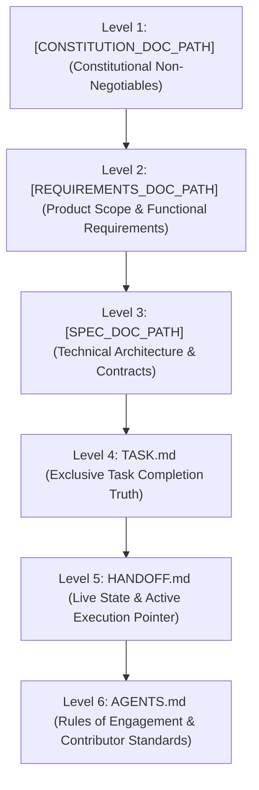

<!--
  TEMPLATE — copy to <repo-root>/SSOT.md and fill in every [PLACEHOLDER].
  See docs/SYNDICATE_PROTOCOL.md for the full rationale behind every rule below.
-->

# 🎯 SSOT.md — Single Source of Truth & Anti-Drift Architecture

> **Purpose**: This document establishes the absolute **Single Source of Truth (SSOT)** hierarchy for **[PROJECT_NAME]**.
> When multiple contributors — AI agents and/or humans — collaborate across sessions, **strict adherence to this hierarchy is mandatory to prevent architectural, technical, and operational drift.**

---

## 👑 1. The Authority Hierarchy (Conflict Resolution)

If any discrepancy, ambiguity, or contradiction is detected between documents, conversations, or prompt instructions, **resolve conflicts strictly in this descending order of precedence**:



### Level 1: Constitutional Non-Negotiables — [`[CONSTITUTION_DOC_PATH]`](./[CONSTITUTION_DOC_PATH])
- **Authority**: Absolute. Cannot be overridden by any agent prompt or feature request.
- **Invariants** *(replace with your project's actual non-negotiables — examples below)*:
  1. `[NON_NEGOTIABLE_1]`
  2. `[NON_NEGOTIABLE_2]`
  3. `[NON_NEGOTIABLE_3]`
  > If your project has no hard non-negotiables yet, leave this list empty rather than inventing filler — add entries only when something is genuinely non-negotiable.

### Level 2: Product Requirements — [`[REQUIREMENTS_DOC_PATH]`](./[REQUIREMENTS_DOC_PATH])
- **Authority**: The exclusive definition of *what* the product does.
- Covers functional requirements and non-functional requirements (performance, security, compliance, etc.).

### Level 3: Technical Architecture & Contracts — [`[SPEC_DOC_PATH]`](./[SPEC_DOC_PATH])
- **Authority**: The definitive specification of *how* the system is structured.
- Defines interfaces/types, module contracts, and subsystem responsibilities.

### Level 4: Live Task Status — [`TASK.md`](./TASK.md)
- **Authority**: The **ONLY** document authorized to track task progress and completion.
- **Rule**: If a task is `[x]`, it is completed, verified, and **real working code** — not a stub, mock, or placeholder (see `AGENTS.md` Rule 7). If `[ ]`, it is pending. Contributors must NEVER create parallel task lists or alternative checklists.

### Level 5: Active Operational State — [`HANDOFF.md`](./HANDOFF.md)
- **Authority**: The **ONLY** document authorized to declare the current milestone, the latest commit, the immediate next action, and hand-off state between sessions/contributors.
- **Rule**: Every contributor MUST read `HANDOFF.md` at the start of a session and update it before stopping.

### Level 6: Rules of Engagement — [`AGENTS.md`](./AGENTS.md)
- **Authority**: Governs coding standards, commit discipline, and directory conventions.

---

## 🚫 2. Anti-Drift Operational Protocols

To ensure that no contributor diverges from the architecture, all contributors must obey these 6 rules:

### Rule 1: No Parallel Artifacts or Shadow Trackers
- **Forbidden**: Creating `TODO.md`, `NOTES.md`, `TASKS_NEW.md`, or tracking progress in conversational chat memory.
- **Enforcement**: All tasks live in [`TASK.md`](./TASK.md). All hand-off context lives in [`HANDOFF.md`](./HANDOFF.md).

### Rule 2: Atomic Living Documentation Updates
- Whenever code is added or modified:
  1. Mark the corresponding task in `TASK.md` as `[x]` — only if it is real, working code.
  2. Record the change and update the "Next Steps" pointer in `HANDOFF.md`.
  3. Include documentation updates in the **same commit** as the code changes.

### Rule 3: Strict File System Ownership
- All reference documentation belongs in `docs/`, except the living root files:
  - `README.md` (Public facing overview & quick start)
  - `SSOT.md` (This document — Authority & anti-drift protocols)
  - `TASK.md` (Living task tracker)
  - `HANDOFF.md` (Living hand-off state)
  - `AGENTS.md` (Living contributor rules)

### Rule 4: Mandatory Automated Verification Gate
- No contributor may conclude a task or hand off to another contributor without running and passing the project's verification pipeline (tests, typecheck/lint, build, and the SSOT integrity check — see `scripts/verify-ssot.mjs`). Fill in your project's actual commands below:
  ```bash
  # 1. Run all automated tests
  [TEST_COMMAND]

  # 2. Type-check / lint
  [TYPECHECK_COMMAND]

  # 3. Build/bundle verification
  [BUILD_COMMAND]

  # 4. Single Source of Truth integrity check
  [PACKAGE_MANAGER] run verify:ssot
  ```

### Rule 5: Disciplined Commits
- Commit at the completion of every task, refactor, edit, or feature — not mid-flight on a sub-task of something still in progress.
- Follow Conventional Commits format (`feat:`, `fix:`, `docs:`, `style:`, `refactor:`, `test:`).
- Never leave unstaged or uncommitted working tree changes before handing off.

### Rule 6: No Fake "Complete" Status
- A task may only be marked `[x]` in `TASK.md` if its implementation is real, working code — not a stub, mock fallback, placeholder dialog, or hardcoded/empty structured output pretending to be real. See [`AGENTS.md`](./AGENTS.md) Rule 7 for the full standard.
- **Enforcement**: passing tests only prove the checked-in test cases pass, not that the feature is real. If a review (self, peer, or agent) finds a "complete" component that's actually scaffolding, reopen the task immediately rather than letting the claim stand.

### Rule 7: The Mandatory SEFN Task Review Standard (Decoupled Innovation Architecture)
- When completing any task, milestone, or session, the review and walkthrough presented to developers MUST NOT display raw suggestions and enhancements inline, as this causes confusion and recursive execution loops.
- Instead, the review presentation MUST structuredly detail:
  1. **Innovations Cataloged (`docs/INNOVATION.md`)**: State the count and status of suggestions and enhancements pooled into [`docs/INNOVATION.md`](./docs/INNOVATION.md). Point developers to `syn discover list` or the web dashboard to review them on demand.
  2. **Fixes**: Any identified bugs, rough edges, warnings, or technical debt. **Mandatory**: Fixes MUST be remediated immediately at review or milestone closeout to preserve zero-debt compliance with Rule 6.
  3. **Next-Steps**: The immediate, ordered actionable roadmap tasks to tackle next.
- **Loop Prevention Invariant**: AI agents must NEVER list or auto-implement pooled suggestions or enhancements in standard completion reviews without explicit developer instruction or formal promotion into `TASK.md` via `syn discover promote`. Omitting any of these core facets violates protocol compliance.

---

## 🔄 3. Contributor Onboarding Sequence (First 60 Seconds)

When an incoming contributor (AI agent or human) joins this repository:

1. **Step 1**: Read [`SSOT.md`](./SSOT.md) (understand the authority hierarchy).
2. **Step 2**: Read [`HANDOFF.md`](./HANDOFF.md) (identify current milestone and immediate next task).
3. **Step 3**: Inspect [`TASK.md`](./TASK.md) (confirm completed vs pending items).
4. **Step 4**: Run the verification pipeline to confirm the codebase is green before touching any files.
5. **Step 5**: Execute the active task in small, tested chunks, commit, and update `HANDOFF.md` and `TASK.md`.
